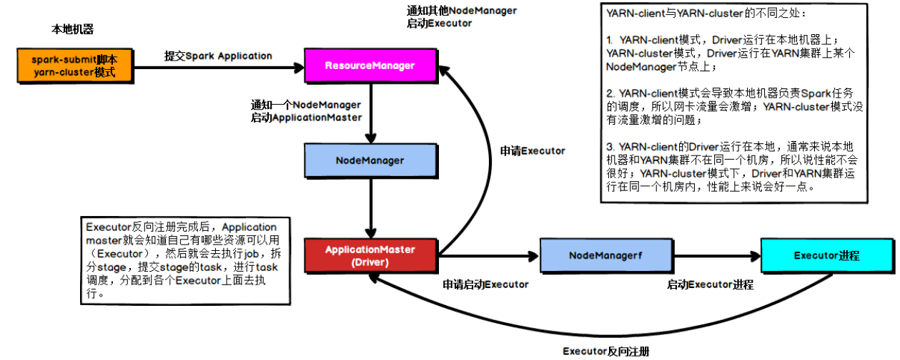

# **Spark**模块

## Spark RDD

### 1.Spark源码系列之foreach和foreachPartition的区别

一，基本使用

```scala
jsonRDD.foreach(each=>{
 //连接数据库
 //插入数据库
 //关闭数据库连接
})

jsonRDD.foreachPartition(partition=>{
 //此处连接上数据库
 partition.foreach(each=>
 //插入数据
 })
 //关闭数据库连接
})
```

二，源码相关
1，第一次封装

```scala
/**

 * Applies a function f to all elements of this RDD.
   */
   def foreach(f: T => Unit): Unit = withScope {
     val cleanF = sc.clean(f)
     sc.runJob(this, (iter: Iterator[T]) => iter.foreach(cleanF))
   }
   /**
 * Applies a function f to each partition of this RDD.
   */
   def foreachPartition(f: Iterator[T] => Unit): Unit = withScope {
     val cleanF = sc.clean(f)
     sc.runJob(this, (iter: Iterator[T]) => cleanF(iter))
   }
```

可以看到方法通过clean操作(清理闭包，为序列化和网络传输做准备)，进行了一层匿名函数的封装，
针对foreach方法，是我们的方法被传入了迭代器的foreach(每个元素遍历执行一次函数)，
而对于foreachpartiton方法是迭代器被传入了我们的方法(每个分区执行一次函数，我们获取迭代器后需要自行进行迭代处理，也即上述第二个demo的partition.foreach)。
2，第二次封装
这次很统一就在

```scala
 * /**
 * Run a job on a given set of partitions of an RDD, but take a function of type
 * `Iterator[T] => U` instead of `(TaskContext, Iterator[T]) => U`.
   */
   def runJob[T, U: ClassTag](
   rdd: RDD[T],
   func: Iterator[T] => U,
   partitions: Seq[Int]): Array[U] = {
     val cleanedFunc = clean(func)
     runJob(rdd, (ctx: TaskContext, it: Iterator[T]) => cleanedFunc(it), partitions)
   }
```

就是讲上述进一步封装的方法进一步按照匿名函数封装
(ctx: TaskContext, it: Iterator[T]) => cleanedFunc(it)
3，执行的时候
Spark的Task类型我们用到的也就两个
1)，ShuffleMapTask
2)，ResultTask
Action算子的方法执行是在ResultTask中执行的，也即ResultTask的runTask方法。
首先反序列化得到我们的方法(2步骤封装的)和RDD，然后执行。传入的是迭代器

```scala
val (rdd, func) = ser.deserialize[(RDD[T], (TaskContext, Iterator[T]) => U)](
  ByteBuffer.wrap(taskBinary.value), Thread.currentThread.getContextClassLoader)
_executorDeserializeTime = System.currentTimeMillis() - deserializeStartTime

metrics = Some(context.taskMetrics)
func(context, rdd.iterator(partition, context))
```

三，总结
RDD.foreach(foreachFunction)
RDD.foreachPatition(foreachPartitionFunction)
经过第二步的分析我们可以理解，展开之后实际上就是
RDD的每个分区的iterator(集合):
iterator.foreach(foreachFunction)
foreachPartitionFunction(iterator)
这就很明显了，假如我们的Function中有数据库，网络TCP等IO链接，文件流等等的创建关闭操作，采用foreachPatition方法，针对每个分区集合进行计算，更能提高我们的性能。

## Spark SQL

### 1.Hive中有1亿条数据，怎么去重（考虑效率）

用力想完，会的三种：开窗过滤、group by、count(distinct)，其实效率都不行
实际生产是拆开数据
参考：https://blog.csdn.net/weixin_39043567/article/details/100590578

### 2.Spark读写XML文件及注意事项

**导入依赖包**

小版本已经到了0.9了

```xml
<dependency>
     <groupId>com.databricks</groupId>
     <artifactId>spark-xml_2.11</artifactId>
     <version>0.9.0</version>
 </dependency>
```

XML文件示例
下面是一个关于书籍的XML文件示例：

```xml
<?xml version="1.0"?>
<catalog>
   <book id="bk101">
      <author>Gambardella, Matthew</author>

      <title>XML Developer's Guide</title>

​      <genre>Computer</genre>
​      <price>44.95</price>
​      <publish_date>2000-10-01</publish_date>
​      <description>


         An in-depth look at creating applications
         with XML.This manual describes Oracle XML DB, and how you can use it to store, generate, manipulate, manage,
         and query XML data in the database.


         After introducing you to the heart of Oracle XML DB, namely the XMLType framework and Oracle XML DB repository,
         the manual provides a brief introduction to design criteria to consider when planning your Oracle XML DB
         application. It provides examples of how and where you can use Oracle XML DB.


         The manual then describes ways you can store and retrieve XML data using Oracle XML DB, APIs for manipulating
         XMLType data, and ways you can view, generate, transform, and search on existing XML data. The remainder of
         the manual discusses how to use Oracle XML DB repository, including versioning and security,
         how to access and manipulate repository resources using protocols, SQL, PL/SQL, or Java, and how to manage
         your Oracle XML DB application using Oracle Enterprise Manager. It also introduces you to XML messaging and
         Oracle Streams Advanced Queuing XMLType support.
      </description>

   </book>
   <book id="bk102">
      <author>Ralls, Kim</author>

      <title>Midnight Rain</title>

​      <genre>Fantasy</genre>
​      <price>5.95</price>
​      <publish_date>2000-12-16</publish_date>
​      <description>A former architect battles corporate zombies, 
​      an evil sorceress, and her own childhood to become queen 
​      of the world.</description>
   </book>
   <book id="bk103">
​      <author>Corets, Eva</author>

      <title>Maeve Ascendant</title>

​      <genre>Fantasy</genre>
​      <price>5.95</price>
​      <publish_date>2000-11-17</publish_date>
​      <description>After the collapse of a nanotechnology 
​      society in England, the young survivors lay the 
​      foundation for a new society.</description>
   </book>
   <book id="bk104">
​      <author>Corets, Eva</author>

      <title>Oberon's Legacy</title>

​      <genre>Fantasy</genre>
​      <price>5.95</price>
​      <publish_date>2001-03-10</publish_date>
​      <description>In post-apocalypse England, the mysterious 
​      agent known only as Oberon helps to create a new life 
​      for the inhabitants of London. Sequel to Maeve 
​      Ascendant.</description>
   </book>
   <book id="bk105">
​      <author>Corets, Eva</author>

      <title>The Sundered Grail</title>

​      <genre>Fantasy</genre>
​      <price>5.95</price>
​      <publish_date>2001-09-10</publish_date>
​      <description>The two daughters of Maeve, half-sisters, 
​      battle one another for control of England. Sequel to 
​      Oberon's Legacy.</description>
   </book>
   <book id="bk106">
​      <author>Randall, Cynthia</author>

      <title>Lover Birds</title>

​      <genre>Romance</genre>
​      <price>4.95</price>
​      <publish_date>2000-09-02</publish_date>
​      <description>When Carla meets Paul at an ornithology 
​      conference, tempers fly as feathers get ruffled.</description>
   </book>
   <book id="bk107">
​      <author>Thurman, Paula</author>

      <title>Splish Splash</title>

​      <genre>Romance</genre>
​      <price>4.95</price>
​      <publish_date>2000-11-02</publish_date>
​      <description>A deep sea diver finds true love twenty 
​      thousand leagues beneath the sea.</description>
   </book>
   <book id="bk108">
​      <author>Knorr, Stefan</author>

      <title>Creepy Crawlies</title>

​      <genre>Horror</genre>
​      <price>4.95</price>
​      <publish_date>2000-12-06</publish_date>
​      <description>An anthology of horror stories about roaches,
​      centipedes, scorpions  and other insects.</description>
   </book>
   <book id="bk109">
​      <author>Kress, Peter</author>

      <title>Paradox Lost</title>

​      <genre>Science Fiction</genre>
​      <price>6.95</price>
​      <publish_date>2000-11-02</publish_date>
​      <description>After an inadvertant trip through a Heisenberg
​      Uncertainty Device, James Salway discovers the problems 
​      of being quantum.</description>
   </book>
   <book id="bk110">
​      <author>O'Brien, Tim</author>

      <title>Microsoft .NET: The Programming Bible</title>

​      <genre>Computer</genre>
​      <price>36.95</price>
​      <publish_date>2000-12-09</publish_date>
​      <description>Microsoft's .NET initiative is explored in 
​      detail in this deep programmer's reference.</description>
   </book>
   <book id="bk111">
​      <author>O'Brien, Tim</author>

      <title>MSXML3: A Comprehensive Guide</title>

​      <genre>Computer</genre>
​      <price>36.95</price>
​      <publish_date>2000-12-01</publish_date>
​      <description>The Microsoft MSXML3 parser is covered in 
​      detail, with attention to XML DOM interfaces, XSLT processing, 
​      SAX and more.</description>
   </book>
   <book id="bk112">
​      <author>Galos, Mike</author>

      <title>Visual Studio 7: A Comprehensive Guide</title>

​      <genre>Computer</genre>
​      <price>49.95</price>
​      <publish_date>2001-04-16</publish_date>
​      <description>Microsoft Visual Studio 7 is explored in depth,
​      looking at how Visual Basic, Visual C++, C#, and ASP+ are 
​      integrated into a comprehensive development 
​      environment.</description>
   </book>
</catalog>
```

**读取XML**

在format函数里指定加载数据源的格式，其中一种情况会加载你指定package路径下的一个叫做DefaultSource.scala的类；还有一种情况，使用短名称，比如csv，avro这些来标记。

```scala
package com.vivo.study.xml
import org.apache.spark.sql.SparkSession
import org.apache.spark.sql.catalyst.expressions.GenericRowWithSchema
import org.apache.spark.sql.types.StructType
object ReadBooksXMLWithNestedArray {
  def main(args: Array[String]): Unit = {
    val spark = SparkSession.builder().master("local[1]")
      .appName("SparkByExample")
      .getOrCreate()
    val df = spark.sqlContext.read
      .format("com.databricks.spark.xml")
      .option("rowTag", "book")
      .load("data/books_complex.xml")
    df.printSchema()
    df.show()
    df.foreach(row=>{
      println(""+row.getAs("author")+","+row.getAs("_id"))
      println(row.getStruct(4).getAs("country"))
      println(row.getStruct(4).getClass)
      val arr = row.getStruct(7).getList(0)
      for (i<-0 to arr.size-1){
        val b = arr.get(i).asInstanceOf[GenericRowWithSchema]
        println(""+b.getAs("name") +","+b.getAs("location"))
      }
    })
  }
}
```

输出的schema如下：

```scala
root
 |-- _id: string (nullable = true)
 |-- author: string (nullable = true)
 |-- description: string (nullable = true)
 |-- genre: string (nullable = true)
 |-- otherInfo: struct (nullable = true)
 |    |-- address: struct (nullable = true)
 |    |    |-- addressline1: string (nullable = true)
 |    |    |-- city: string (nullable = true)
 |    |    |-- state: string (nullable = true)
 |    |-- country: string (nullable = true)
 |    |-- language: string (nullable = true)
 |    |-- pagesCount: long (nullable = true)
 |-- price: double (nullable = true)
 |-- publish_date: string (nullable = true)
 |-- stores: struct (nullable = true)
 |    |-- store: array (nullable = true)
 |    |    |-- element: struct (containsNull = true)
 |    |    |    |-- location: string (nullable = true)
 |    |    |    |-- name: string (nullable = true)
 |-- title: string (nullable = true)
```

大家从上面的案例应该留意以下几点：

1. 我们并没有指定schema信息，但是却打印出来了schema信息，说明spark sql自己推断出了xml格式文件的schema。
2. 嵌套深层数组类型的数据格式，并且带schema的，他的读取方式。浪尖这里也给出了案例。
3. rowTag就是 xml文件的row tag，其实还有一个root tag就是xml文件的root tag。
4. _id 字段是属于XML自身的字段，为了区分加了前缀 下划线 _ 。当然前缀 是下划线你假如看不惯的话，那就完全可以通过attributePrefix属性来修改。这些属性由于不属于用户，假如不关心，可以直接禁止掉，参数是excludeAttribute。

**写测XML
**

格式很简单，但是写XML的概率比较低。比较推荐的是parquet和orc。

```scala
df2.write
      .format("com.databricks.spark.xml")
      .option("rootTag", "books")
      .option("rowTag", "book")
      .save("src/main/resources/books_new.xml")
```

**明确的指定schema**

推断schema总是要耗性能的，而且假设你知道schema明确的指定，也方便你管理和别人接手。

```scala
package com.vivo.study.xml
import org.apache.spark.sql.SparkSession
import org.apache.spark.sql.catalyst.expressions.GenericRowWithSchema
import org.apache.spark.sql.types._
object ReadBooksXMLWithNestedArrayStruct {
  def main(args: Array[String]): Unit = {
    val spark = SparkSession.builder().master("local[1]")
      .appName("langjian")
      .getOrCreate()
    val customSchema = StructType(Array(
      StructField("_id", StringType, nullable = true),
      StructField("author", StringType, nullable = true),
      StructField("description", StringType, nullable = true),
      StructField("genre", StringType ,nullable = true),
      StructField("price", DoubleType, nullable = true),
      StructField("publish_date", StringType, nullable = true),
      StructField("title", StringType, nullable = true),
      StructField("otherInfo",StructType(Array(
        StructField("pagesCount", StringType, nullable = true),
        StructField("language", StringType, nullable = true),
        StructField("country", StringType, nullable = true),
        StructField("address", StructType(Array(
          StructField("addressline1", StringType, nullable = true),
          StructField("city", StringType, nullable = true),
          StructField("state", StringType, nullable = true)
          ))
        ))
      )),
      StructField("stores",StructType(Array(
        StructField("store",ArrayType(
          StructType(Array(
            StructField("location",StringType,true),
            StructField("name",StringType,true)
          ))
        ))
      )))
    ))
    val df = spark.sqlContext.read
      .format("com.databricks.spark.xml")
      .option("rowTag", "book")
      .schema(customSchema)
      .load("data/books_complex.xml")
    df.printSchema()
    df.show()
    df.foreach(row=>{
      println(""+row.getAs("author")+","+row.getAs("_id"))
      println(row.getAs[GenericRowWithSchema]("otherInfo").getAs("country"))
      println(row.getStruct(7).getClass)
      val arr = row.getStruct(8).getList(0)
      for (i<-0 to arr.size-1){
        val b = arr.get(i).asInstanceOf[GenericRowWithSchema]
        println(""+b.getAs("name") +","+b.getAs("location"))
      }
    })
  }
}
```

提示以下，看看我这里第三个println里如何解析嵌套型数据结构的。

对应的打印schema

```scala
root
 |-- _id: string (nullable = true)
 |-- author: string (nullable = true)
 |-- description: string (nullable = true)
 |-- genre: string (nullable = true)
 |-- price: double (nullable = true)
 |-- publish_date: string (nullable = true)
 |-- title: string (nullable = true)
 |-- otherInfo: struct (nullable = true)
 |    |-- pagesCount: string (nullable = true)
 |    |-- language: string (nullable = true)
 |    |-- country: string (nullable = true)
 |    |-- address: struct (nullable = true)
 |    |    |-- addressline1: string (nullable = true)
 |    |    |-- city: string (nullable = true)
 |    |    |-- state: string (nullable = true)
 |-- stores: struct (nullable = true)
 |    |-- store: array (nullable = true)
 |    |    |-- element: struct (containsNull = true)
 |    |    |    |-- location: string (nullable = true)
 |    |    |    |-- name: string (nullable = true)
```

这个小案例的数据如下：

```xml
<?xml version="1.0"?>
<catalog>
   <book id="bk101">
      <author>Gambardella, Matthew</author>

      <title>XML Developer's Guide</title>

​      <genre>Computer</genre>
​      <price>44.95</price>
​      <publish_date>2000-10-01</publish_date>
​      <description>


         An in-depth look at creating applications
         with XML.This manual describes Oracle XML DB, and how you can use it to store, generate, manipulate, manage,
         and query XML data in the database.


         After introducing you to the heart of Oracle XML DB, namely the XMLType framework and Oracle XML DB repository,
         the manual provides a brief introduction to design criteria to consider when planning your Oracle XML DB
         application. It provides examples of how and where you can use Oracle XML DB.


         The manual then describes ways you can store and retrieve XML data using Oracle XML DB, APIs for manipulating
         XMLType data, and ways you can view, generate, transform, and search on existing XML data. The remainder of
         the manual discusses how to use Oracle XML DB repository, including versioning and security,
         how to access and manipulate repository resources using protocols, SQL, PL/SQL, or Java, and how to manage
         your Oracle XML DB application using Oracle Enterprise Manager. It also introduces you to XML messaging and
         Oracle Streams Advanced Queuing XMLType support.
      </description>
      <otherInfo>
         <pagesCount>100</pagesCount>
         <language>english</language>
         <country>India</country>
         <address>
               <addressline1>3417 south plaza dr</addressline1>
               <city>Costa mesa</city>
               <state>CA</state>
         </address>
      </otherInfo>
      <stores>
         <store>
            <name>Costco</name>
            <location>usa</location>
         </store>
         <store>
            <name>Target</name>
            <location>UK</location>
         </store>
      </stores>

   </book>
   <book id="bk102">
      <author>Ralls, Kim</author>

      <title>Midnight Rain</title>

​      <genre>Fantasy</genre>
​      <price>5.95</price>
​      <publish_date>2000-12-16</publish_date>
​      <description>A former architect battles corporate zombies, 
​      an evil sorceress, and her own childhood to become queen 
​      of the world.</description>
​      <otherInfo>
​         <pagesCount>100</pagesCount>
​         <language>english</language>
​         <country>India</country>

         <address>
            <addressline1>3417 south plaza dr</addressline1>
            <city>Costa mesa</city>
            <state>CA</state>
         </address>
      </otherInfo>
      <stores>
         <store>
            <name>Costco</name>
         </store>
         <store>
            <name>Target</name>
         </store>
         <store>
            <name>Walmart</name>
         </store>
      </stores>
   </book>
   <book id="bk103">
      <author>Corets, Eva</author>
      <title>Maeve Ascendant</title>
      <genre>Fantasy</genre>
      <price>5.95</price>
      <publish_date>2000-11-17</publish_date>
      <description>After the collapse of a nanotechnology 
      society in England, the young survivors lay the 
      foundation for a new society.</description>
      <otherInfo>
         <pagesCount>100</pagesCount>
         <language>english</language>
         <country>India</country>
         <address>
            <addressline1>3417 south plaza dr</addressline1>
            <city>Costa mesa</city>
            <state>CA</state>
         </address>
      </otherInfo>
      <stores>
         <store>
            <name>Costco</name>
         </store>
      </stores>
   </book>
   <book id="bk104">
      <author>Corets, Eva</author>
      <title>Oberon's Legacy</title>
      <genre>Fantasy</genre>
      <price>5.95</price>
      <publish_date>2001-03-10</publish_date>
      <description>In post-apocalypse England, the mysterious 
      agent known only as Oberon helps to create a new life 
      for the inhabitants of London. Sequel to Maeve 
      Ascendant.</description>
      <otherInfo>
         <pagesCount>100</pagesCount>
         <language>english</language>
         <country>India</country>
         <address>
            <addressline1>3417 south plaza dr</addressline1>
            <city>Costa mesa</city>
            <state>CA</state>
         </address>
      </otherInfo>
      <stores>
         <store>
            <name>Costco</name>
         </store>
      </stores>
   </book>
   <book id="bk105">
      <author>Corets, Eva</author>
      <title>The Sundered Grail</title>
      <genre>Fantasy</genre>
      <price>5.95</price>
      <publish_date>2001-09-10</publish_date>
      <description>The two daughters of Maeve, half-sisters, 
      battle one another for control of England. Sequel to 
      Oberon's Legacy.</description>
      <otherInfo>
         <pagesCount>100</pagesCount>
         <language>english</language>
         <country>India</country>
         <address>
            <addressline1>3417 south plaza dr</addressline1>
            <city>Costa mesa</city>
            <state>CA</state>
         </address>
      </otherInfo>
      <stores>
         <store>
            <name>Costco</name>
         </store>
      </stores>
   </book>
   <book id="bk106">
      <author>Randall, Cynthia</author>
      <title>Lover Birds</title>
      <genre>Romance</genre>
      <price>4.95</price>
      <publish_date>2000-09-02</publish_date>
      <description>When Carla meets Paul at an ornithology 
      conference, tempers fly as feathers get ruffled.</description>
      <otherInfo>
         <pagesCount>100</pagesCount>
         <language>english</language>
         <country>India</country>
         <address>
            <addressline1>3417 south plaza dr</addressline1>
            <city>Costa mesa</city>
            <state>CA</state>
         </address>
      </otherInfo>
      <stores>
         <store>
            <name>Costco</name>
         </store>
      </stores>
   </book>
   <book id="bk107">
      <author>Thurman, Paula</author>
      <title>Splish Splash</title>
      <genre>Romance</genre>
      <price>4.95</price>
      <publish_date>2000-11-02</publish_date>
      <description>A deep sea diver finds true love twenty 
      thousand leagues beneath the sea.</description>
      <otherInfo>
         <pagesCount>100</pagesCount>
         <language>english</language>
         <country>India</country>
         <address>
            <addressline1>3417 south plaza dr</addressline1>
            <city>Costa mesa</city>
            <state>CA</state>
         </address>
      </otherInfo>
      <stores>
         <store>
            <name>Costco</name>
         </store>
      </stores>
   </book>
   <book id="bk108">
      <author>Knorr, Stefan</author>
      <title>Creepy Crawlies</title>
      <genre>Horror</genre>
      <price>4.95</price>
      <publish_date>2000-12-06</publish_date>
      <description>An anthology of horror stories about roaches,
      centipedes, scorpions  and other insects.</description>
      <otherInfo>
         <pagesCount>100</pagesCount>
         <language>english</language>
         <country>India</country>
         <address>
            <addressline1>3417 south plaza dr</addressline1>
            <city>Costa mesa</city>
            <state>CA</state>
         </address>
      </otherInfo>
      <stores>
         <store>
            <name>Costco</name>
         </store>
      </stores>
   </book>
   <book id="bk109">
      <author>Kress, Peter</author>
      <title>Paradox Lost</title>
      <genre>Science Fiction</genre>
      <price>6.95</price>
      <publish_date>2000-11-02</publish_date>
      <description>After an inadvertant trip through a Heisenberg
      Uncertainty Device, James Salway discovers the problems 
      of being quantum.</description>
      <otherInfo>
         <pagesCount>100</pagesCount>
         <language>english</language>
         <country>India</country>
         <address>
            <addressline1>3417 south plaza dr</addressline1>
            <city>Costa mesa</city>
            <state>CA</state>
         </address>
      </otherInfo>
      <stores>
         <store>
            <name>Costco</name>
         </store>
      </stores>
   </book>
   <book id="bk110">
      <author>O'Brien, Tim</author>
      <title>Microsoft .NET: The Programming Bible</title>
      <genre>Computer</genre>
      <price>36.95</price>
      <publish_date>2000-12-09</publish_date>
      <description>Microsoft's .NET initiative is explored in 
      detail in this deep programmer's reference.</description>
      <otherInfo>
         <pagesCount>100</pagesCount>
         <language>english</language>
         <country>India</country>
         <address>
            <addressline1>3417 south plaza dr</addressline1>
            <city>Costa mesa</city>
            <state>CA</state>
         </address>
      </otherInfo>
      <stores>
         <store>
            <name>Costco</name>
         </store>
      </stores>
   </book>
   <book id="bk111">
      <author>O'Brien, Tim</author>
      <title>MSXML3: A Comprehensive Guide</title>
      <genre>Computer</genre>
      <price>36.95</price>
      <publish_date>2000-12-01</publish_date>
      <description>The Microsoft MSXML3 parser is covered in 
      detail, with attention to XML DOM interfaces, XSLT processing, 
      SAX and more.</description>
      <otherInfo>
         <pagesCount>100</pagesCount>
         <language>english</language>
         <country>India</country>
         <address>
            <addressline1>3417 south plaza dr</addressline1>
            <city>Costa mesa</city>
            <state>CA</state>
         </address>
      </otherInfo>
      <stores>
         <store>
            <name>Costco</name>
         </store>
      </stores>
   </book>
   <book id="bk112">
      <author>Galos, Mike</author>
      <title>Visual Studio 7: A Comprehensive Guide</title>
      <genre>Computer</genre>
      <price>49.95</price>
      <publish_date>2001-04-16</publish_date>
      <description>Microsoft Visual Studio 7 is explored in depth,
      looking at how Visual Basic, Visual C++, C#, and ASP+ are 
      integrated into a comprehensive development 
      environment.</description>
      <otherInfo>
         <pagesCount>100</pagesCount>
         <language>english</language>
         <country>India</country>
         <address>
            <addressline1>3417 south plaza dr</addressline1>
            <city>Costa mesa</city>
            <state>CA</state>
         </address>
      </otherInfo>
      <stores>
         <store>
            <name>Costco</name>
         </store>
      </stores>
   </book>
</catalog>
```

## Spark Streaming

### 1.SparkStreaming控制小文件的输出

四个方法
参考：https://blog.csdn.net/lsr40/article/details/104970906/

### 2.Spark Streaming 中管理 Kafka Offsets 的几种方式

Offset管理概述

Spark Streaming集成了Kafka允许用户从Kafka中读取一个或者多个topic的数据。一个Kafka topic包含多个存储消息的分区（partition）。每个分区中的消息是顺序存储，并且用offset（可以认为是位置）来标记消息。开发者可以在他的Spark Streaming应用中通过offset来控制数据的读取位置，但是这需要好的offset的管理机制。

Offsets管理对于保证流式应用在整个生命周期中数据的连贯性是非常有益的。举个例子，如果在应用停止或者报错退出之前没有将offset保存在持久化数据库中，那么offset rangges就会丢失。更进一步说，如果没有保存每个分区已经读取的offset，那么Spark Streaming就没有办法从上次断开（停止或者报错导致）的位置继续读取消息。

Offsets可以通过多种方式来管理，但是一般来说遵循下面的步骤:

- 在 Direct DStream初始化的时候，需要指定一个包含每个topic的每个分区的offset用于让Direct DStream从指定位置读取数据。

- - offsets就是步骤4中所保存的offsets位置

- 读取并处理消息

- 处理完之后存储结果数据

- - 用虚线圈存储和提交offset只是简单强调用户可能会执行一系列操作来满足他们更加严格的语义要求。这包括幂等操作和通过原子操作的方式存储offset。

- 最后，将offsets保存在外部持久化数据库如 HBase, Kafka, HDFS, and ZooKeeper中

不同的方案可以根据不同的商业需求进行组合。Spark具有很好的编程范式允许用户很好的控制offsets的保存时机。认真考虑以下的情形：一个Spark  Streaming 应用从Kafka中读取数据，处理或者转换数据，然后将数据发送到另一个topic或者其他系统中（例如其他消息系统、Hbase、Solr、DBMS等等）。在这个例子中，我们只考虑消息处理之后发送到其他系统中

将Offsests存储在外部系统

在这一章节中，我们将来探讨一下不同的外部持久化存储选项

为了更好地理解这一章节中提到的内容，我们先来做一些铺垫。如果是使用 spark-streaming-kafka-0-10，那么我们建议将 enable.auto.commit 设为false。这个配置只是在这个版本生效，enable.auto.commit 如果设为true的话，那么意味着 offsets 会按照 auto.commit.interval.ms 中所配置的间隔来周期性自动提交到Kafka中。在Spark Streaming中，将这个选项设置为true的话会使得Spark应用从kafka中读取数据之后就自动提交，而不是数据处理之后提交，这不是我们想要的。所以为了更好地控制offsets的提交，我们建议将enable.auto.commit 设为false。

Spark Streaming checkpoints

使用Spark Streaming的checkpoint是最简单的存储方式，并且在Spark 框架中很容易实现。Spark Streaming checkpoints就是为保存应用状态而设计的，我们将路径这在HDFS上，所以能够从失败中恢复数据。

对Kafka Stream 执行checkpoint操作使得offset保存在checkpoint中，如果是应用挂掉的话，那么SparkStreamig应用功能可以从保存的offset中开始读取消息。但是，如果是对Spark Streaming应用进行升级的话，那么很抱歉，不能checkpoint的数据没法使用，所以这种机制并不可靠，特别是在严格的生产环境中，我们不推荐这种方式。

将offsets存储在HBase中

HBase可以作为一个可靠的外部数据库来持久化offsets。通过将offsets存储在外部系统中，Spark Streaming应用功能能够重读或者回放任何仍然存储在Kafka中的数据。

根据HBase的设计模式，允许应用能够以rowkey和column的结构将多个Spark Streaming应用和多个Kafka topic存放在一张表格中。在这个例子中，表格以topic名称、消费者group id和Spark Streaming 的batchTime.milliSeconds作为rowkey以做唯一标识。尽管batchTime.milliSeconds不是必须的，但是它能够更好地展示历史的每批次的offsets。表格将存储30天的累积数据，如果超出30天则会被移除。下面是创建表格的DDL和结构

```shell
1DDL
2create 'stream_kafka_offsets', {NAME=>'offsets', TTL=>2592000}
3RowKey Layout:
4row:           <TOPIC_NAME>:<GROUP_ID>:<EPOCH_BATCHTIME_MS>
5column family:   offsets
6qualifier:      <PARTITION_ID>
7value:         <OFFSET_ID>
```

对每一个批次的消息，使用saveOffsets()将从指定topic中读取的offsets保存到HBase中

```scala
1/*
 2 Save offsets for each batch into HBase
 3*/
 4def saveOffsets(TOPIC_NAME:String,GROUP_ID:String,offsetRanges:Array[OffsetRange],
 5                hbaseTableName:String,batchTime: org.apache.spark.streaming.Time) ={
 6  val hbaseConf = HBaseConfiguration.create()
 7  hbaseConf.addResource("src/main/resources/hbase-site.xml")
 8  val conn = ConnectionFactory.createConnection(hbaseConf)
 9  val table = conn.getTable(TableName.valueOf(hbaseTableName))
10  val rowKey = TOPIC_NAME + ":" + GROUP_ID + ":" +String.valueOf(batchTime.milliseconds)
11  val put = new Put(rowKey.getBytes)
12  for(offset <- offsetRanges){
13    put.addColumn(Bytes.toBytes("offsets"),Bytes.toBytes(offset.partition.toString),
14          Bytes.toBytes(offset.untilOffset.toString))
15  }
16  table.put(put)
17  conn.close()
18}
```

在执行streaming任务之前，首先会使用getLastCommittedOffsets()来从HBase中读取上一次任务结束时所保存的offsets。该方法将采用常用方案来返回kafka topic分区offsets。

- **情形1**：Streaming任务第一次启动，从zookeeper中获取给定topic的分区数，然后将每个分区的offset都设置为0，并返回。
- **情形2**：一个运行了很长时间的streaming任务停止并且给定的topic增加了新的分区，处理方式是从zookeeper中获取给定topic的分区数，对于所有老的分区，offset依然使用HBase中所保存，对于新的分区则将offset设置为0。
- **情形3**：Streaming任务长时间运行后停止并且topic分区没有任何变化，在这个情形下，直接使用HBase中所保存的offset即可。

在Spark Streaming应用启动之后如果topic增加了新的分区，那么应用只能读取到老的分区中的数据，新的是读取不到的。所以如果想读取新的分区中的数据，那么就得重新启动Spark Streaming应用。

```scala
1/* Returns last committed offsets for all the partitions of a given topic from HBase in  
 2following  cases.
 3*/
 4def getLastCommittedOffsets(TOPIC_NAME:String,GROUP_ID:String,hbaseTableName:String,
 5zkQuorum:String,zkRootDir:String,sessionTimeout:Int,connectionTimeOut:Int):Map[TopicPartition,Long] ={
 6  val hbaseConf = HBaseConfiguration.create()
 7  val zkUrl = zkQuorum+"/"+zkRootDir
 8  val zkClientAndConnection = ZkUtils.createZkClientAndConnection(zkUrl,
 9                                                sessionTimeout,connectionTimeOut)
10  val zkUtils = new ZkUtils(zkClientAndConnection._1, zkClientAndConnection._2,false)
11  val zKNumberOfPartitionsForTopic = zkUtils.getPartitionsForTopics(Seq(TOPIC_NAME
12                                                 )).get(TOPIC_NAME).toList.head.size
13  zkClientAndConnection._1.close()
14  zkClientAndConnection._2.close()
15  //Connect to HBase to retrieve last committed offsets
16  val conn = ConnectionFactory.createConnection(hbaseConf)
17  val table = conn.getTable(TableName.valueOf(hbaseTableName))
18  val startRow = TOPIC_NAME + ":" + GROUP_ID + ":" +
19                                              String.valueOf(System.currentTimeMillis())
20  val stopRow = TOPIC_NAME + ":" + GROUP_ID + ":" + 0
21  val scan = new Scan()
22  val scanner = table.getScanner(scan.setStartRow(startRow.getBytes).setStopRow(
23                                                   stopRow.getBytes).setReversed(true))
24  val result = scanner.next()
25  var hbaseNumberOfPartitionsForTopic = 0 //Set the number of partitions discovered for a topic in HBase to 0
26  if (result != null){
27  //If the result from hbase scanner is not null, set number of partitions from hbase 
28  to the  number of cells
29    hbaseNumberOfPartitionsForTopic = result.listCells().size()
30  }
31val fromOffsets = collection.mutable.Map[TopicPartition,Long]()
32  if(hbaseNumberOfPartitionsForTopic == 0){
33    // initialize fromOffsets to beginning
34    for (partition <- 0 to zKNumberOfPartitionsForTopic-1){
35      fromOffsets += (new TopicPartition(TOPIC_NAME,partition) -> 0)
36    }
37  } else if(zKNumberOfPartitionsForTopic > hbaseNumberOfPartitionsForTopic){
38  // handle scenario where new partitions have been added to existing kafka topic
39    for (partition <- 0 to hbaseNumberOfPartitionsForTopic-1){
40      val fromOffset = Bytes.toString(result.getValue(Bytes.toBytes("offsets"),
41                                        Bytes.toBytes(partition.toString)))
42      fromOffsets += (new TopicPartition(TOPIC_NAME,partition) -> fromOffset.toLong)
43    }
44    for (partition <- hbaseNumberOfPartitionsForTopic to zKNumberOfPartitionsForTopic-1){
45      fromOffsets += (new TopicPartition(TOPIC_NAME,partition) -> 0)
46    }
47  } else {
48  //initialize fromOffsets from last run
49    for (partition <- 0 to hbaseNumberOfPartitionsForTopic-1 ){
50      val fromOffset = Bytes.toString(result.getValue(Bytes.toBytes("offsets"),
51                                        Bytes.toBytes(partition.toString)))
52      fromOffsets += (new TopicPartition(TOPIC_NAME,partition) -> fromOffset.toLong)
53    }
54  }
55  scanner.close()
56  conn.close()
57  fromOffsets.toMap
58}
```

当我们获取到offsets之后我们就可以创建一个Kafka Direct DStream

```scala
1val fromOffsets= getLastCommittedOffsets(topic,consumerGroupID,hbaseTableName,zkQuorum,
2                                        zkKafkaRootDir,zkSessionTimeOut,zkConnectionTimeOut)
3val inputDStream = KafkaUtils.createDirectStream[String,String](ssc,PreferConsistent,
4                           Assign[String, String](fromOffsets.keys,kafkaParams,fromOffsets))
在完成本批次的数据处理之后调用saveOffsets()保存offsets.

 1/*
 2For each RDD in a DStream apply a map transformation that processes the message.
 3*/
 4inputDStream.foreachRDD((rdd,batchTime) => {
 5  val offsetRanges = rdd.asInstanceOf[HasOffsetRanges].offsetRanges
 6  offsetRanges.foreach(offset => println(offset.topic,offset.partition, offset.fromOffset,
 7                        offset.untilOffset))
 8  val newRDD = rdd.map(message => processMessage(message))
 9  newRDD.count()
10  saveOffsets(topic,consumerGroupID,offsetRanges,hbaseTableName,batchTime) 
11})
```


你可以到HBase中去查看不同topic和消费者组的offset数据

```shell
 1hbase(main):001:0> scan 'stream_kafka_offsets', {REVERSED => true}
 2ROW                                                COLUMN+CELL
 3 kafkablog2:groupid-1:1497628830000                column=offsets:0, timestamp=1497628832448, value=285
 4 kafkablog2:groupid-1:1497628830000                column=offsets:1, timestamp=1497628832448, value=285
 5 kafkablog2:groupid-1:1497628830000                column=offsets:2, timestamp=1497628832448, value=285
 6 kafkablog2:groupid-1:1497628770000                column=offsets:0, timestamp=1497628773773, value=225
 7 kafkablog2:groupid-1:1497628770000                column=offsets:1, timestamp=1497628773773, value=225
 8 kafkablog2:groupid-1:1497628770000                column=offsets:2, timestamp=1497628773773, value=225
 9 kafkablog1:groupid-2:1497628650000                column=offsets:0, timestamp=1497628653451, value=165
10 kafkablog1:groupid-2:1497628650000                column=offsets:1, timestamp=1497628653451, value=165
11 kafkablog1:groupid-2:1497628650000                column=offsets:2, timestamp=1497628653451, value=165
12 kafkablog1:groupid-1:1497628530000                column=offsets:0, timestamp=1497628533108, value=120
13 kafkablog1:groupid-1:1497628530000                column=offsets:1, timestamp=1497628533108, value=120
14 kafkablog1:groupid-1:1497628530000                column=offsets:2, timestamp=1497628533108, value=120
154 row(s) in 0.5030 seconds
16hbase(main):002:0>
17
```

将offsets存储到 ZooKeeper中

在Spark Streaming连接Kafka应用中使用Zookeeper来存储offsets也是一种比较可靠的方式。

在这个方案中，Spark Streaming任务在启动时会去Zookeeper中读取每个分区的offsets。如果有新的分区出现，那么他的offset将会设置在最开始的位置。在每批数据处理完之后，用户需要可以选择存储已处理数据的一个offset或者最后一个offset。此外，新消费者将使用跟旧的Kafka 消费者API一样的格式将offset保存在ZooKeeper中。因此，任何追踪或监控Zookeeper中Kafka Offset的工具仍然生效的。

初始化Zookeeper connection来从Zookeeper中获取offsets

 1val zkClientAndConnection = ZkUtils.createZkClientAndConnection(zkUrl, sessionTimeout, connectionTimeout)
 2val zkUtils = new ZkUtils(zkClientAndConnection._1, zkClientAndConnection._2, false)
 3def readOffsets(topics: Seq[String], groupId:String):
 4 Map[TopicPartition, Long] = {
 5 val topicPartOffsetMap = collection.mutable.HashMap.empty[TopicPartition, Long]
 6 val partitionMap = zkUtils.getPartitionsForTopics(topics)
 7 // /consumers/<groupId>/offsets/<topic>/
 8 partitionMap.foreach(topicPartitions => {
 9   val zkGroupTopicDirs = new ZKGroupTopicDirs(groupId, topicPartitions._1)
10   topicPartitions._2.foreach(partition => {
11     val offsetPath = zkGroupTopicDirs.consumerOffsetDir + "/" + partition
12     try {
13       val offsetStatTuple = zkUtils.readData(offsetPath)
14       if (offsetStatTuple != null) {
15         LOGGER.info("retrieving offset details - topic: {}, partition: {}, offset: {}, node path: {}", Seq[AnyRef](topicPartitions._1, partition.toString, offsetStatTuple._1, offsetPath): _*)
16         topicPartOffsetMap.put(new TopicPartition(topicPartitions._1, Integer.valueOf(partition)),
17           offsetStatTuple._1.toLong)
18       }
19     } catch {
20       case e: Exception =>
21         LOGGER.warn("retrieving offset details - no previous node exists:" + " {}, topic: {}, partition: {}, node path: {}", Seq[AnyRef](e.getMessage, topicPartitions._1, partition.toString, offsetPath): _*)
22         topicPartOffsetMap.put(new TopicPartition(topicPartitions._1, Integer.valueOf(partition)), 0L)
23     }
24   })
25 })
26 topicPartOffsetMap.toMap
27}
使用获取到的offsets来初始化Kafka Direct DStream

1val inputDStream = KafkaUtils.createDirectStream(ssc, PreferConsistent, ConsumerStrategies.Subscribe[String,String](topics, kafkaParams, fromOffsets))
下面是从ZooKeeper获取一组offsets的方法

注意: Kafka offset在ZooKeeper中的存储路径为/consumers/[groupId]/offsets/topic/[partitionId], 存储的值为offset
 1def persistOffsets(offsets: Seq[OffsetRange], groupId: String, storeEndOffset: Boolean): Unit = {
 2 offsets.foreach(or => {
 3   val zkGroupTopicDirs = new ZKGroupTopicDirs(groupId, or.topic);
 4   val acls = new ListBuffer[ACL]()
 5   val acl = new ACL
 6   acl.setId(ANYONE_ID_UNSAFE)
 7   acl.setPerms(PERMISSIONS_ALL)
 8   acls += acl
 9   val offsetPath = zkGroupTopicDirs.consumerOffsetDir + "/" + or.partition;
10   val offsetVal = if (storeEndOffset) or.untilOffset else or.fromOffset
11   zkUtils.updatePersistentPath(zkGroupTopicDirs.consumerOffsetDir + "/"
12     + or.partition, offsetVal + "", JavaConversions.bufferAsJavaList(acls))
13   LOGGER.debug("persisting offset details - topic: {}, partition: {}, offset: {}, node path: {}", Seq[AnyRef](or.topic, or.partition.toString, offsetVal.toString, offsetPath): _*)
14 })
15}
Kafka 本身

Apache Spark 2.1.x以及spark-streaming-kafka-0-10使用新的的消费者API即异步提交API。你可以在你确保你处理后的数据已经妥善保存之后使用commitAsync API（异步提交 API）来向Kafka提交offsets。新的消费者API会以消费者组id作为唯一标识来提交offsets

将offsets提交到Kafka中

1stream.foreachRDD { rdd =>
2  val offsetRanges = rdd.asInstanceOf[HasOffsetRanges].offsetRanges
3  // some time later, after outputs have completed
4  stream.asInstanceOf[CanCommitOffsets].commitAsync(offsetRanges)
5}

### 3.spark streaming窗口聚合操作后如何管理offset

对于spark streaming来说窗口操作之后，是无法管理offset的，因为offset的存储于HasOffsetRanges。只有kafkaRDD继承了他，所以假如我们对KafkaRDD进行了转化之后就无法再获取offset了。

还有窗口之后的offset的管理，也是很麻烦的，主要原因就是窗口操作会包含若干批次的RDD数据，那么提交offset我们只需要提交最近的那个批次的kafkaRDD的offset即可。如何获取呢？

对于spark 来说代码执行位置分为driver和executor，我们希望再driver端获取到offset，在处理完结果提交offset，或者直接与结果一起管理offset。

说到driver端执行，其实我们只需要使用transform获取到offset信息，然后在输出操作foreachrdd里面使用提交即可。

```scala
package bigdata.spark.SparkStreaming.kafka010

import java.util.Properties

import org.apache.kafka.clients.consumer.{Consumer, ConsumerRecord, KafkaConsumer}
import org.apache.kafka.common.TopicPartition
import org.apache.kafka.common.serialization.StringDeserializer
import org.apache.spark.rdd.RDD
import org.apache.spark.streaming.kafka010._
import org.apache.spark.streaming.{Seconds, StreamingContext}
import org.apache.spark.{SparkConf, TaskContext}

import scala.collection.JavaConverters._
import scala.collection.mutable

object kafka010NamedRDD {
   def main(args: Array[String]) {
      //    创建一个批处理时间是2s的context 要增加环境变量
      val sparkConf = new SparkConf().setAppName("DirectKafkaWordCount").setMaster("local[*]")
      val ssc = new StreamingContext(sparkConf, Seconds(5))

     ssc.checkpoint("/opt/checkpoint")
    
      //    使用broker和topic创建DirectStream
      val topicsSet = "test".split(",").toSet
      val kafkaParams = Map[String, Object]("bootstrap.servers" -> "mt-mdh.local:9093",
        "key.deserializer"->classOf[StringDeserializer],
        "value.deserializer"-> classOf[StringDeserializer],
        "group.id"->"test4",
        "auto.offset.reset" -> "latest",
        "enable.auto.commit"->(false: java.lang.Boolean))
    
     // 没有接口提供 offset
      val messages = KafkaUtils.createDirectStream[String, String](
        ssc,
        LocationStrategies.PreferConsistent,
        ConsumerStrategies.Subscribe[String, String](topicsSet, kafkaParams,getLastOffsets(kafkaParams ,topicsSet)))//
     var A:mutable.HashMap[String,Array[OffsetRange]] = new mutable.HashMap()
    
     val trans = messages.transform(r =>{
       val offsetRanges = r.asInstanceOf[HasOffsetRanges].offsetRanges
       A += ("rdd1"->offsetRanges)
       r
     }).countByWindow(Seconds(10), Seconds(5))
     trans.foreachRDD(rdd=>{
    
       if(!rdd.isEmpty()){
         val offsetRanges = A.get("rdd1").get//.asInstanceOf[HasOffsetRanges].offsetRanges
    
         rdd.foreachPartition { iter =>
           val o: OffsetRange = offsetRanges(TaskContext.get.partitionId)
           println(s"${o.topic} ${o.partition} ${o.fromOffset} ${o.untilOffset}")
         }
    
         println(rdd.count())
         println(offsetRanges)
         // 手动提交offset ，前提是禁止自动提交
         messages.asInstanceOf[CanCommitOffsets].commitAsync(offsetRanges)
    
       }

//       A.-("rdd1")
     })
      //    启动流
      ssc.start()
      ssc.awaitTermination()
    }
  def getLastOffsets(kafkaParams : Map[String, Object],topics:Set[String]): Map[TopicPartition, Long] ={
    val props = new Properties()
    props.putAll(kafkaParams.asJava)
    val consumer = new KafkaConsumer[String, String](props)
    consumer.subscribe(topics.asJavaCollection)
    paranoidPoll(consumer)
    val map = consumer.assignment().asScala.map { tp =>
      println(tp+"---" +consumer.position(tp))
      tp -> (consumer.position(tp))
    }.toMap
    println(map)
    consumer.close()
    map
  }
  def paranoidPoll(c: Consumer[String, String]): Unit = {
    val msgs = c.poll(0)
    if (!msgs.isEmpty) {
      // position should be minimum offset per topicpartition
      msgs.asScala.foldLeft(Map[TopicPartition, Long]()) { (acc, m) =>
        val tp = new TopicPartition(m.topic, m.partition)
        val off = acc.get(tp).map(o => Math.min(o, m.offset)).getOrElse(m.offset)
        acc + (tp -> off)
      }.foreach { case (tp, off) =>
        c.seek(tp, off)
      }
    }
  }
}
```


## Spark 调优

### 1.spark 内存，GC及数据结构调优

**一，基本概述**

调优内存的使用主要有三个方面的考虑：对象的内存占用量(你可能希望整个数据集都适合内存)，访问这些数据的开销，垃圾回收的负载。

默认情况下，java的对象是可以快速访问的，但是相比于内部的原始数据消耗估计2-5倍的空间。主要归于下面三个原因：

1),每个不同的Java对象都有一个“对象头”，它大约是16个字节，包含一个指向它的类的指针。对于一个数据很少的对象（比如一个Int字段），这可以比数据大。

2),Java字符串在原始字符串数据上具有大约40字节的开销（因为它们将它们存储在一个Chars数组中，并保留额外的数据，例如长度），并且由于String的内部使用UTF-16编码而将每个字符存储为两个字节。因此，一个10个字符的字符串可以容易地消耗60个字节。

3),常用集合类（如HashMap和LinkedList）使用链接的数据结构，其中每个条目都有一个“包装器”对象（例如Map.Entry）。该对象不仅具有头部，还包括指针（通常为8个字节）到列表中的下一个对象。

4),原始类型的集合通常将它们存储为“boxed”对象，如java.lang.Integer。

本节将从Spark的内存管理概述开始，然后讨论用户可以采取的具体策略，以便在他/她的应用程序中更有效地使用内存。具体来说，我们将描述如何确定对象的内存使用情况，以及如何改进数据结构，或通过以序列化的格式存储数据。然后我们将介绍调优Spark的缓存大小和Java垃圾回收器。

**二，spark的内存管理概述**

Spark中的内存使用大部分属于两类：执行和存储。运行内存指的是用于计算的，shuffle，joins，sorts 和aggregations，然后存储内存主要用于缓存和在集群中传播的内部数据。在spark内部，存储器和执行器共享一个统一的区域(M)。**当没有使用执行器内存的时候，存储器可以获取所有可用的执行器内存，反之亦然。**如果有需要执行器可以驱逐存储占用，但是仅仅当存储内存大于一个阈值(R)的时候才会发生。换句话说，R描述了M内部的一个子区域，R中的缓存永远不会被清除。**由于实施的复杂性，存储内存不得驱逐执行内存**。该设计保证了几个理想的性能。

首先，不使用缓存的应用程序可以将整个空间用于执行，从而避免不必要的磁盘溢写。

其次，使用缓存的应用程序可以保留最小的存储空间（R），其中数据块不受驱逐。

最后，这种方法为各种工作负载提供了合理的开箱即用性能，而不需要用户掌握内部如何分配内存的专业知识。

虽然有两个相关配置，但典型用户不需要调整它们，因为默认值适用于大多数工作负载：

1),spark.memory.fraction将M的大小表示为（JVM堆空间 - 300MB）的一部分（默认为0.75，新版本如spark2.2改为0.6）。剩余的空间（25％，对应的新版本是0.4）用于用户数据结构，Spark中的内部元数据，并且在稀疏和异常大的记录的情况下保护OOM错误。

2),spark.memory.storageFraction表示R的大小作为M的一部分（默认为0.5）。R是M内的存储空间，其中缓存的块免于被执行器驱逐。


**三，确定内存的消耗**

最好的方式去计算一个数据的的内存消耗，就是创建一个RDD，然后加入cache，这样就可以在web ui中Storage页面看到了。页面会告诉你，这个RDD消耗了多少内存。

要估计特定对象的内存消耗，请使用SizeEstimator的估计方法。这对于尝试使用不同的数据布局来修剪内存使用情况以及确定广播变量在每个执行程序堆中占用的空间量非常有用。

**四，调优数据结构**

减少内存消耗的第一种方法是避免使用增加负担的java特性，例如基于指针的数据结构和包装对象。下面几种方法可以来避免这个。

1,将数据结构设计为偏好对象数组和原始类型，而不是标准的Java或Scala集合类（例如HashMap）。fastutil库(http://fastutil.di.unimi.it/)为与Java标准库兼容的原始类型提供方便的集合类。

2,尽可能避免使用有很多小对象和指针的嵌套结构。

3,针对关键词，考虑使用数字ID或者枚举对象而不是字符串。

4,如果您的RAM少于32 GB，请设置JVM标志-XX：+ UseCompressedOops使指针为四个字节而不是八个字节。您可以在spark-env.sh中添加这些选项。

**五，序列化RDD**

尽管进行了调优，当您的对象仍然太大而无法有效存储时，一个简单的方法来减少内存使用是使用RDD持久性API中的序列化StorageLevel（如MEMORY_ONLY_SER）以序列化形式存储它们。Spark将会将每个RDD分区存储为一个大字节数组。以序列化形式存储数据的唯一缺点是数据访问变慢，因为必须对每个对象进行反序列化。如果您想以序列化形式缓存数据，我们强烈建议使用Kryo，因为它会使数据比java序列化后的大小更小（而且肯定比原Java对象更小）。

**六，垃圾回收调优**

**1，基本介绍**

当你程序的RDD频繁的变动的时候，垃圾回收将会是一个问题。RDD的一次读入，然后有很多种基于它的计算，这种情况下垃圾回收没啥问题。当JAVA需要驱逐旧的对象，为新对象腾出空间的时候，需要跟踪所有Java对象并找到无用的对象。要记住的要点是，垃圾收集的成本与Java对象的数量成正比，因此使用较少对象的数据结构（例如，Ints数组，代替LinkedList）将大大降低了成本。一个更好的方法是以序列化形式持久化对象，如上所述：每个RDD分区将只有一个对象（一个字节数组）。在尝试其他技术之前，如果GC是一个问题，首先要尝试的是使用序列化缓存。

由于任务的运行内存和RDD的缓存内存的干扰，GC也会是一个问题。

**2，测量GC的影响**

GC调优的第一步是收集关于垃圾收集发生频率和GC花费的时间的统计信息。通过将-verbose：gc -XX：+ PrintGCDetails -XX：+ PrintGCTimeStamps添加到Java选项来完成。下次运行Spark作业时，每当垃圾收集发生时，都会看到在工作日志中打印的消息。请注意，这些日志将在您的群集的Executor节点上（在其工作目录中的stdout文件中），而不是您的driver功能中。

**3，高级GC调优**

为了进一步调整垃圾收集，我们首先需要了解一些关于JVM内存管理的基本信息<详细的请看：[JVM的垃圾回收算法](http://mp.weixin.qq.com/s?__biz=MzA3MDY0NTMxOQ==&mid=2247483661&idx=1&sn=d6427470f125b58e92a5d6b27085e982&chksm=9f38e225a84f6b3374e48002abc6f86d5190a9cf5ce59fa5ad6ca4bdd2df64c654e8f85c5413&scene=21#wechat_redirect)>：

1),java的堆内存分为两个区域新生代和老年代。新生代保存的是生命周期比较短的对象，老年代保存生命周期比较长的对象。

2),新生代又分为了三个区域(Eden, Survivor1, Survivor2)。

3),垃圾收集过程的简化说明：当Eden已满时，Eden上运行了一个minor GC，并将Eden和Survivor1中存在的对象复制到Survivor2。Survivor 将进行交换。如果一个对象足够老，或者Survivor2已满，则会移动到老年代。最后当老年代接近满的时候，会触发full GC。

Spark应用程序GC调优的目标是，确保生命周期比较长的RDD保存在老年代，新生代有足够的空间保存生命周期比较短的对象。这有助于避免触发Full GC去收集task运行期间产生的临时变量。下面列举几个有用的步骤：

1),通过收集垃圾回收信息，判断是否有太多的垃圾回收过程。假如full gc在一个task完成之前触发了好几次，那说明运行task的内存空间不足，需要加内存。

2),**在gc的统计信息中，如果老年代接近满了，减少用于缓存的内存(通过减小spark.memory.Fraction)。**缓存较少的对象比降低运行速度对我们来说更有好处。另外，可以考虑减少年轻代。可以通过减小-Xmn参数设置的值，假如使用的话。假如没有设置可以修改JVM的NewRation参数。大多数JVMs默认值是2，意思是老年代占用了三分之二的总内存。这个值要足够大，相当于扩展了spark.memory.fraction.

3),如果有太多的minor gc，较少的major gc，增加Eden区内存会有帮助。将Eden区内存设置的比task运行估计内存稍微大一些。如果Eden区大小确定为E，那就将新生代的内存设置为-Xmn=4/3E，按比例增加内存是考虑到survivor区所占用的内存。

4),尝试通过设置-XX:+UseG1GC垃圾回收器为G1。在垃圾回收器是瓶颈的一些情况下，它可以提高性能。请注意，对于大的Executor堆，通过使用-XX:G!HeapRegionSize去增大G1的堆大小，显得尤为重要。

5),例如，如果您的任务是从HDFS读取数据，则可以使用从HDFS读取的数据块的大小来估计任务使用的内存量。请注意，解压缩块的大小通常是块大小的2或3倍。所以如果我们希望有3或4个任务的工作空间，HDFS块的大小是64 MB，我们可以估计Eden的大小是4 * 3 * 64MB。

5),监控垃圾收集的频率和时间如何随着新设置的变化而变化。

经验表明，GC调整的效果取决于您的应用程序和可用的内存量。下面的链接里有更多的在线描述的调优的选项，但在高层次上，管理GC的全面发生频率有助于减少开销。

### 2.了解spark的钨丝计划吗？

https://blog.csdn.net/sundujing/article/details/51424491

### 3.Spark OOM的本质。

可从两方面：map执行时oom，shuffle后oom
参考：https://www.cnblogs.com/jiangxiaoxian/p/7442022.html

### 4.常规性能调优

#### 常规性能调优一：最优资源配置

Spark性能调优的第一步，就是为任务分配更多的资源，在一定范围内，增加资源的分配与性能的提升是成正比的，实现了最优的资源配置后，在此基础上再考虑进行后面论述的性能调优策略。
资源的分配在使用脚本提交Spark任务时进行指定，标准的Spark任务提交脚本如代码清单2-1所示：
代码清单2-1 标准Spark提交脚本

```shell
/opt/spark/bin/spark-submit \
--class com.bigdata.spark.Analysis \
--num-executors 80 \
--driver-memory 6g \
--executor-memory 6g \
--executor-cores 3 \
/opt/spark/jar/spark.jar \
```

| 名称                  | 说明                           |
| --------------------- | ------------------------------ |
| **--num-executors**   | 配置Executor的数量             |
| **--driver-memory**   | 配置Driver内存（影响不大）     |
| **--executor-memory** | 配置每个Executor的内存大小     |
| **--executor-cores**  | 配置每个Executor的CPU core数量 |

​			调节原则：尽量将任务分配的资源调节到可以使用的资源的最大限度。
对于具体资源的分配，我们分别讨论Spark的两种Cluster运行模式：
​			第一种是Spark Standalone模式，你在提交任务前，一定知道或者可以从运维部门获取到你可以使用的资源情况，在编写submit脚本的时候，就根据可用的资源情况进行资源的分配，比如说集群有15台机器，每台机器为8G内存，2个CPU core，那么就指定15个Executor，每个Executor分配8G内存，2个CPU core。
​			第二种是Spark Yarn模式，由于Yarn使用资源队列进行资源的分配和调度，在表写submit脚本的时候，就根据Spark作业要提交到的资源队列，进行资源的分配，比如资源队列有400G内存，100个CPU core，那么指定50个Executor，每个Executor分配8G内存，2个CPU core。

| 名称                               | 解析                                                         |
| :--------------------------------- | ------------------------------------------------------------ |
| **增加Executor·个数**              | 在资源允许的情况下，增加Executor的个数可以提高执行task的并行度。比如有4个Executor，每个Executor有2个CPU core，那么可以并行执行8个task，如果将Executor的个数增加到8个（资源允许的情况下），那么可以并行执行16个task，此时的并行能力提升了一倍。 |
| **增加每个Executor的CPU core个数** | 在资源允许的情况下，增加每个Executor的Cpu core个数，可以提高执行task的并行度。比如有4个Executor，每个Executor有2个CPU core，那么可以并行执行8个task，如果将每个Executor的CPU core个数增加到4个（资源允许的情况下），那么可以并行执行16个task，此时的并行能力提升了一倍。 |
| **增加每个Executor的内存量**       | 在资源允许的情况下，增加每个Executor的内存量以后，对性能的提升有三点：1. 可以缓存更多的数据（即对RDD进行cache），写入磁盘的数据相应减少，甚至可以不写入磁盘，减少了可能的磁盘IO；2. 可以为shuffle操作提供更多内存，即有更多空间来存放reduce端拉取的数据，写入磁盘的数据相应减少，甚至可以不写入磁盘，减少了可能的磁盘IO；3. 可以为task的执行提供更多内存，在task的执行过程中可能创建很多对象，内存较小时会引发频繁的GC，增加内存后，可以避免频繁的GC，提升整体性能。 |

####  常规性能调优二：RDD优化

- RDD复用
  在对RDD进行算子时，要避免相同的算子和计算逻辑之下对RDD进行重复的计算

  

  对RDD计算架构进行修改，得到的优化结果：

  

- RDD持久化

  在Spark中，当多次对同一个RDD执行算子操作时，每一次都会对这个RDD以之前的父RDD重新计算一次，这种情况是必须要避免的，对同一个RDD的重复计算是对资源的极大浪费，因此，必须对多次使用的RDD进行持久化，通过持久化将公共RDD的数据缓存到内存/磁盘中，之后对于公共RDD的计算都会从内存/磁盘中直接获取RDD数据。

  对于RDD的持久化，有两点需要说明：

  ​		第一，RDD的持久化是可以进行序列化的，当内存无法将RDD的数据完整的进行存放的时候，可以考虑使用序列化的方式减小数据体积，将数据完整存储在内存中。

  ​		第二，如果对于数据的可靠性要求很高，并且内存充足，可以使用副本机制，对RDD数据进行持久化。当持久化启用了复本机制时，对于持久化的每个数据单元都存储一个副本，放在其他节点上面，由此实现数据的容错，一旦一个副本数据丢失，不需要重新计算，还可以使用另外一个副本。

- RDD尽可能早的filter操作

  获取到初始RDD后，应该考虑尽早地过滤掉不需要的数据，进而减少对内存的占用，从而提升Spark作业的运行效率。

#### 常规性能调优三：并行度调节

Spark作业中的并行度指各个stage的task的数量。

如果并行度设置不合理而导致并行度过低，会导致资源的极大浪费，例如，20个Executor，每个Executor分配3个CPU core，而Spark作业有40个task，这样每个Executor分配到的task个数是2个，这就使得每个Executor有一个CPU core空闲，导致资源的浪费。

理想的并行度设置，应该是让并行度与资源相匹配，简单来说就是在资源允许的前提下，并行度要设置的尽可能大，达到可以充分利用集群资源。合理的设置并行度，可以提升整个Spark作业的性能和运行速度。

Spark官方推荐，task数量应该设置为Spark作业总CPU core数量的2~3倍。之所以没有推荐task数量与CPU core总数相等，是因为task的执行时间不同，有的task执行速度快而有的task执行速度慢，如果task数量与CPU core总数相等，那么执行快的task执行完成后，会出现CPU core空闲的情况。如果task数量设置为CPU core总数的2~3倍，那么一个task执行完毕后，CPU core会立刻执行下一个task，降低了资源的浪费，同时提升了Spark作业运行的效率。

#### 常规性能调优四：广播大变量

默认情况下，task中的算子中如果使用了外部的变量，每个task都会获取一份变量的复本，这就造成了内存的极大消耗。一方面，如果后续对RDD进行持久化，可能就无法将RDD数据存入内存，只能写入磁盘，磁盘IO将会严重消耗性能；另一方面，task在创建对象的时候，也许会发现堆内存无法存放新创建的对象，这就会导致频繁的GC，GC会导致工作线程停止，进而导致Spark暂停工作一段时间，严重影响Spark性能。

假设当前任务配置了20个Executor，指定500个task，有一个20M的变量被所有task共用，此时会在500个task中产生500个副本，耗费集群10G的内存，如果使用了广播变量， 那么每个Executor保存一个副本，一共消耗400M内存，内存消耗减少了5倍。

广播变量在每个Executor保存一个副本，此Executor的所有task共用此广播变量，这让变量产生的副本数量大大减少。

在初始阶段，广播变量只在Driver中有一份副本。task在运行的时候，想要使用广播变量中的数据，此时首先会在自己本地的Executor对应的BlockManager中尝试获取变量，如果本地没有，BlockManager就会从Driver或者其他节点的BlockManager上远程拉取变量的复本，并由本地的BlockManager进行管理；之后此Executor的所有task都会直接从本地的BlockManager中获取变量。

#### 常规性能调优五：Kryo序列化

默认情况下，Spark使用Java的序列化机制。Java的序列化机制使用方便，不需要额外的配置，在算子中使用的变量实现Serializable接口即可，但是，Java序列化机制的效率不高，序列化速度慢并且序列化后的数据所占用的空间依然较大。

Kryo序列化机制比Java序列化机制性能提高10倍左右，Spark之所以没有默认使用Kryo作为序列化类库，是因为它不支持所有对象的序列化，同时Kryo需要用户在使用前注册需要序列化的类型，不够方便，但从Spark 2.0.0版本开始，简单类型、简单类型数组、字符串类型的Shuffling RDDs 已经默认使用Kryo序列化方式了。

```java
public class MyKryoRegistrator implements KryoRegistrator
{
  @Override
  public void registerClasses(Kryo kryo)
  {
    kryo.register(StartupReportLogs.class);
  }
}
```

```scala
//创建SparkConf对象

val conf = new SparkConf().setMaster(…).setAppName(…)

//使用Kryo序列化库，如果要使用Java序列化库，需要把该行屏蔽掉

conf.set("spark.serializer", "org.apache.spark.serializer.KryoSerializer");  

//在Kryo序列化库中注册自定义的类集合，如果要使用Java序列化库，需要把该行屏蔽掉

conf.set("spark.kryo.registrator", "bigdata.com.MyKryoRegistrator"); 
```

#### 常规性能调优六：调节本地化等待时长

​		Spark作业运行过程中，Driver会对每一个stage的task进行分配。根据Spark的task分配算法，Spark希望task能够运行在它要计算的数据算在的节点（数据本地化思想），这样就可以避免数据的网络传输。通常来说，task可能不会被分配到它处理的数据所在的节点，因为这些节点可用的资源可能已经用尽，此时，Spark会等待一段时间，默认3s，如果等待指定时间后仍然无法在指定节点运行，那么会自动降级，尝试将task分配到比较差的本地化级别所对应的节点上，比如将task分配到离它要计算的数据比较近的一个节点，然后进行计算，如果当前级别仍然不行，那么继续降级。

​		当task要处理的数据不在task所在节点上时，会发生数据的传输。task会通过所在节点的BlockManager获取数据，BlockManager发现数据不在本地时，户通过网络传输组件从数据所在节点的BlockManager处获取数据。

​		网络传输数据的情况是我们不愿意看到的，大量的网络传输会严重影响性能，因此，我们希望通过调节本地化等待时长，如果在等待时长这段时间内，目标节点处理完成了一部分task，那么当前的task将有机会得到执行，这样就能够改善Spark作业的整体性能。

| 名称              | 解析                                                         |
| ----------------- | ------------------------------------------------------------ |
| **PROCESS_LOCAL** | 进程本地化，task和数据在同一个Executor中，性能最好。         |
| **NODE_LOCAL**    | 节点本地化，task和数据在同一个节点中，但是task和数据不在同一个Executor中，数据需要在进程间进行传输。 |
| **RACK_LOCAL**    | 机架本地化，task和数据在同一个机架的两个节点上，数据需要通过网络在节点之间进行传输。 |
| **NO_PREF**       | 对于task来说，从哪里获取都一样，没有好坏之分。               |
| **ANY**           | task和数据可以在集群的任何地方，而且不在一个机架中，性能最差。 |

​		在Spark项目开发阶段，可以使用client模式对程序进行测试，此时，可以在本地看到比较全的日志信息，日志信息中有明确的task数据本地化的级别，如果大部分都是PROCESS_LOCAL，那么就无需进行调节，但是如果发现很多的级别都是NODE_LOCAL、ANY，那么需要对本地化的等待时长进行调节，通过延长本地化等待时长，看看task的本地化级别有没有提升，并观察Spark作业的运行时间有没有缩短。

​		注意，过犹不及，不要将本地化等待时长延长地过长，导致因为大量的等待时长，使得Spark作业的运行时间反而增加了。

```scala
val conf = new SparkConf().set("spark.locality.wait", "6")
```

### 5.算子调优

#### 算子调优一：mapPartitions

​		普通的map算子对RDD中的每一个元素进行操作，而mapPartitions算子对RDD中每一个分区进行操作。如果是普通的map算子，假设一个partition有1万条数据，那么map算子中的function要执行1万次，也就是对每个元素进行操作。


​		如果是mapPartition算子，由于一个task处理一个RDD的partition，那么一个task只会执行一次function，function一次接收所有的partition数据，效率比较高。


​		比如，当要把RDD中的所有数据通过JDBC写入数据，如果使用map算子，那么需要对RDD中的每一个元素都创建一个数据库连接，这样对资源的消耗很大，如果使用mapPartitions算子，那么针对一个分区的数据，只需要建立一个数据库连接。
​		mapPartitions算子也存在一些缺点：对于普通的map操作，一次处理一条数据，如果在处理了2000条数据后内存不足，那么可以将已经处理完的2000条数据从内存中垃圾回收掉；但是如果使用mapPartitions算子，但数据量非常大时，function一次处理一个分区的数据，如果一旦内存不足，此时无法回收内存，就可能会OOM，即内存溢出。
因此，mapPartitions算子适用于数据量不是特别大的时候，此时使用mapPartitions算子对性能的提升效果还是不错的。（当数据量很大的时候，一旦使用mapPartitions算子，就会直接OOM）
在项目中，应该首先估算一下RDD的数据量、每个partition的数据量，以及分配给每个Executor的内存资源，如果资源允许，可以考虑使用mapPartitions算子代替map。

#### 算子调优二：foreachPartition优化数据库操作

​		在生产环境中，通常使用foreachPartition算子来完成数据库的写入，通过foreachPartition算子的特性，可以优化写数据库的性能。
​		如果使用foreach算子完成数据库的操作，由于foreach算子是遍历RDD的每条数据，因此，每条数据都会建立一个数据库连接，这是对资源的极大浪费，因此，对于写数据库操作，我们应当使用foreachPartition算子。
与mapPartitions算子非常相似，foreachPartition是将RDD的每个分区作为遍历对象，一次处理一个分区的数据，也就是说，如果涉及数据库的相关操作，一个分区的数据只需要创建一次数据库连接

使用了foreachPartition算子后，可以获得以下的性能提升：

1. 对于我们写的function函数，一次处理一整个分区的数据；
2. 对于一个分区内的数据，创建唯一的数据库连接；
3. 只需要向数据库发送一次SQL语句和多组参数；
在生产环境中，全部都会使用foreachPartition算子完成数据库操作。foreachPartition算子存在一个问题，与mapPartitions算子类似，如果一个分区的数据量特别大，可能会造成OOM，即内存溢出。

#### 算子调优三：filter与coalesce的配合使用

​		在Spark任务中我们经常会使用filter算子完成RDD中数据的过滤，在任务初始阶段，从各个分区中加载到的数据量是相近的，但是一旦进过filter过滤后，每个分区的数据量有可能会存在较大差异，如图2-6所示：


我们可以发现两个问题：

1. 每个partition的数据量变小了，如果还按照之前与partition相等的task个数去处理当前数据，有点浪费task的计算资源；

2. 每个partition的数据量不一样，会导致后面的每个task处理每个partition数据的时候，每个task要处理的数据量不同，这很有可能导致数据倾斜问题。

  ​	第二个分区的数据过滤后只剩100条，而第三个分区的数据过滤后剩下800条，在相同的处理逻辑下，第二个分区对应的task处理的数据量与第三个分区对应的task处理的数据量差距达到了8倍，这也会导致运行速度可能存在数倍的差距，这也就是数据倾斜问题。
  针对上述的两个问题，我们分别进行分析：

  1. 针对第一个问题，既然分区的数据量变小了，我们希望可以对分区数据进行重新分配，比如将原来4个分区的数据转化到2个分区中，这样只需要用后面的两个task进行处理即可，避免了资源的浪费。
  2. 针对第二个问题，解决方法和第一个问题的解决方法非常相似，对分区数据重新分配，让每个partition中的数据量差不多，这就避免了数据倾斜问题。
    那么具体应该如何实现上面的解决思路？我们需要coalesce算子。
    repartition与coalesce都可以用来进行重分区，其中repartition只是coalesce接口中shuffle为true的简易实现，coalesce默认情况下不进行shuffle，但是可以通过参数进行设置。
    假设我们希望将原本的分区个数A通过重新分区变为B，那么有以下几种情况：
    1.A > B（多数分区合并为少数分区）
    ① A与B相差值不大
    此时使用coalesce即可，无需shuffle过程。
    ② A与B相差值很大
    此时可以使用coalesce并且不启用shuffle过程，但是会导致合并过程性能低下，所以推荐设置coalesce的第二个参数为true，即启动shuffle过程。
    2.A < B（少数分区分解为多数分区）
    此时使用repartition即可，如果使用coalesce需要将shuffle设置为true，否则coalesce无效。
    我们可以在filter操作之后，使用coalesce算子针对每个partition的数据量各不相同的情况，压缩partition的数量，而且让每个partition的数据量尽量均匀紧凑，以便于后面的task进行计算操作，在某种程度上能够在一定程度上提升性能。
    注意：local模式是进程内模拟集群运行，已经对并行度和分区数量有了一定的内部优化，因此不用去设置并行度和分区数量。

#### 算子调优四：repartition解决SparkSQL低并行度问题

​		在常规性能调优中我们讲解了并行度的调节策略，但是，并行度的设置对于Spark SQL是不生效的，用户设置的并行度只对于Spark SQL以外的所有Spark的stage生效。
​		Spark SQL的并行度不允许用户自己指定，Spark SQL自己会默认根据hive表对应的HDFS文件的split个数自动设置Spark SQL所在的那个stage的并行度，用户自己通spark.default.parallelism参数指定的并行度，只会在没Spark SQL的stage中生效。
​		由于Spark SQL所在stage的并行度无法手动设置，如果数据量较大，并且此stage中后续的transformation操作有着复杂的业务逻辑，而Spark SQL自动设置的task数量很少，这就意味着每个task要处理为数不少的数据量，然后还要执行非常复杂的处理逻辑，这就可能表现为第一个有Spark SQL的stage速度很慢，而后续的没有Spark SQL的stage运行速度非常快。
为了解决Spark SQL无法设置并行度和task数量的问题，我们可以使用repartition算子。


Spark SQL这一步的并行度和task数量肯定是没有办法去改变了，但是，对于Spark SQL查询出来的RDD，立即使用repartition算子，去重新进行分区，这样可以重新分区为多个partition，从repartition之后的RDD操作，由于不再设计Spark SQL，因此stage的并行度就会等于你手动设置的值，这样就避免了Spark SQL所在的stage只能用少量的task去处理大量数据并执行复杂的算法逻辑。使用repartition算子的前后对比如图2-7所示。

#### 算子调优五：reduceByKey本地聚合

reduceByKey相较于普通的shuffle操作一个显著的特点就是会进行map端的本地聚合，map端会先对本地的数据进行combine操作，然后将数据写入给下个stage的每个task创建的文件中，也就是在map端，对每一个key对应的value，执行reduceByKey算子函数。reduceByKey算子的执行过程如图2-8所示：


使用reduceByKey对性能的提升如下：
1.本地聚合后，在map端的数据量变少，减少了磁盘IO，也减少了对磁盘空间的占用；
2.本地聚合后，下一个stage拉取的数据量变少，减少了网络传输的数据量；
3.本地聚合后，在reduce端进行数据缓存的内存占用减少；
4.本地聚合后，在reduce端进行聚合的数据量减少。
基于reduceByKey的本地聚合特征，我们应该考虑使用reduceByKey代替其他的shuffle算子，例如groupByKey。reduceByKey与groupByKey的运行原理如图2-9和图2-10所示：


根据上图可知，groupByKey不会进行map端的聚合，而是将所有map端的数据shuffle到reduce端，然后在reduce端进行数据的聚合操作。由于reduceByKey有map端聚合的特性，使得网络传输的数据量减小，因此效率要明显高于groupByKey。

### 6.Shuffle调优

#### Shuffle调优一：调节map端缓冲区大小

在Spark任务运行过程中，如果shuffle的map端处理的数据量比较大，但是map端缓冲的大小是固定的，可能会出现map端缓冲数据频繁spill溢写到磁盘文件中的情况，使得性能非常低下，通过调节map端缓冲的大小，可以避免频繁的磁盘IO操作，进而提升Spark任务的整体性能。
map端缓冲的默认配置是32KB，如果每个task处理640KB的数据，那么会发生640/32 = 20次溢写，如果每个task处理64000KB的数据，机会发生64000/32=2000此溢写，这对于性能的影响是非常严重的。
map端缓冲配置

```scala
val conf = new SparkConf()
  .set("spark.shuffle.file.buffer", "64")
```


#### Shuffle调优二：调节reduce端拉取数据缓冲区大小

Spark Shuffle过程中，shuffle reduce task的buffer缓冲区大小决定了reduce task每次能够缓冲的数据量，也就是每次能够拉取的数据量，如果内存资源较为充足，适当增加拉取数据缓冲区的大小，可以减少拉取数据的次数，也就可以减少网络传输的次数，进而提升性能。
reduce端数据拉取缓冲区的大小可以通过spark.reducer.maxSizeInFlight参数进行设置，默认为48MB
reduce端数据拉取缓冲区配置

```scala
val conf = new SparkConf()
  .set("spark.reducer.maxSizeInFlight", "96")
```


#### Shuffle调优三：调节reduce端拉取数据重试次数

Spark Shuffle过程中，reduce task拉取属于自己的数据时，如果因为网络异常等原因导致失败会自动进行重试。对于那些包含了特别耗时的shuffle操作的作业，建议增加重试最大次数（比如60次），以避免由于JVM的full gc或者网络不稳定等因素导致的数据拉取失败。在实践中发现，对于针对超大数据量（数十亿~上百亿）的shuffle过程，调节该参数可以大幅度提升稳定性。
reduce端拉取数据重试次数可以通过spark.shuffle.io.maxRetries参数进行设置，该参数就代表了可以重试的最大次数。如果在指定次数之内拉取还是没有成功，就可能会导致作业执行失败，默认为3
reduce端拉取数据重试次数配置

```scala
val conf = new SparkConf()
  .set("spark.shuffle.io.maxRetries", "6")
```


#### Shuffle调优四：调节reduce端拉取数据等待间隔

Spark Shuffle过程中，reduce task拉取属于自己的数据时，如果因为网络异常等原因导致失败会自动进行重试，在一次失败后，会等待一定的时间间隔再进行重试，可以通过加大间隔时长（比如60s），以增加shuffle操作的稳定性。
reduce端拉取数据等待间隔可以通过spark.shuffle.io.retryWait参数进行设置，默认值为5s
 reduce端拉取数据等待间隔配置

```scala
val conf = new SparkConf()
  .set("spark.shuffle.io.retryWait", "60s")
```

#### Shuffle调优五：调节SortShuffle排序操作阈值

对于SortShuffleManager，如果shuffle reduce task的数量小于某一阈值则shuffle write过程中不会进行排序操作，而是直接按照未经优化的HashShuffleManager的方式去写数据，但是最后会将每个task产生的所有临时磁盘文件都合并成一个文件，并会创建单独的索引文件。
当你使用SortShuffleManager时，如果的确不需要排序操作，那么建议将这个参数调大一些，大于shuffle read task的数量，那么此时map-side就不会进行排序了，减少了排序的性能开销，但是这种方式下，依然会产生大量的磁盘文件，因此shuffle write性能有待提高。
SortShuffleManager排序操作阈值的设置可以通过spark.shuffle.sort. bypassMergeThreshold这一参数进行设置，默认值为200reduce端拉取数据等待间隔配置

```scala
val conf = new SparkConf()
  .set("spark.shuffle.sort.bypassMergeThreshold", "400")
```

### JVM调优

对于JVM调优，首先应该明确，(major)full gc/minor gc，都会导致JVM的工作线程停止工作，即stop the world。

#### JVM调优一：降低cache操作的内存占比

1. 	静态内存管理机制
根据Spark静态内存管理机制，堆内存被划分为了两块，Storage和Execution。Storage主要用于缓存RDD数据和broadcast数据，Execution主要用于缓存在shuffle过程中产生的中间数据，Storage占系统内存的60%，Execution占系统内存的20%，并且两者完全独立。
在一般情况下，Storage的内存都提供给了cache操作，但是如果在某些情况下cache操作内存不是很紧张，而task的算子中创建的对象很多，Execution内存又相对较小，这回导致频繁的minor gc，甚至于频繁的full gc，进而导致Spark频繁的停止工作，性能影响会很大。
在Spark UI中可以查看每个stage的运行情况，包括每个task的运行时间、gc时间等等，如果发现gc太频繁，时间太长，就可以考虑调节Storage的内存占比，让task执行算子函数式，有更多的内存可以使用。
Storage内存区域可以通过spark.storage.memoryFraction参数进行指定，默认为0.6，即60%，可以逐级向下递减

Storage内存占比设置
  
  ```scala
  val conf = new SparkConf()
    .set("spark.storage.memoryFraction", "0.4")
  ```
  
  
  
2. 统一内存管理机制
   根据Spark统一内存管理机制，堆内存被划分为了两块，Storage和Execution。Storage主要用于缓存数据，Execution主要用于缓存在shuffle过程中产生的中间数据，两者所组成的内存部分称为统一内存，Storage和Execution各占统一内存的50%，由于动态占用机制的实现，shuffle过程需要的内存过大时，会自动占用Storage的内存区域，因此无需手动进行调节。

#### JVM调优二：调节Executor堆外内存 

​		Executor的堆外内存主要用于程序的共享库、Perm Space、 线程Stack和一些Memory mapping等, 或者类C方式allocate object。
​		有时，如果你的Spark作业处理的数据量非常大，达到几亿的数据量，此时运行Spark作业会时不时地报错，例如shuffle output file cannot find，executor lost，task lost，out of memory等，这可能是Executor的堆外内存不太够用，导致Executor在运行的过程中内存溢出。
​		stage的task在运行的时候，可能要从一些Executor中去拉取shuffle map output文件，但是Executor可能已经由于内存溢出挂掉了，其关联的BlockManager也没有了，这就可能会报出shuffle output file cannot find，executor lost，task lost，out of memory等错误，此时，就可以考虑调节一下Executor的堆外内存，也就可以避免报错，与此同时，堆外内存调节的比较大的时候，对于性能来讲，也会带来一定的提升。
​		默认情况下，Executor堆外内存上限大概为300多MB，在实际的生产环境下，对海量数据进行处理的时候，这里都会出现问题，导致Spark作业反复崩溃，无法运行，此时就会去调节这个参数，到至少1G，甚至于2G、4G。
Executor堆外内存的配置需要在spark-submit脚本里配置

Executor堆外内存配置

```shell
--conf spark.yarn.executor.memoryOverhead=2048
```

以上参数配置完成后，会避免掉某些JVM OOM的异常问题，同时，可以提升整体Spark作业的性能。

#### JVM调优三：调节连接等待时长 

​		在Spark作业运行过程中，Executor优先从自己本地关联的BlockManager中获取某份数据，如果本地BlockManager没有的话，会通过TransferService远程连接其他节点上Executor的BlockManager来获取数据。
如果task在运行过程中创建大量对象或者创建的对象较大，会占用大量的内存，这回导致频繁的垃圾回收，但是垃圾回收会导致工作现场全部停止，也就是说，垃圾回收一旦执行，Spark的Executor进程就会停止工作，无法提供相应，此时，由于没有响应，无法建立网络连接，会导致网络连接超时。
​		在生产环境下，有时会遇到file not found、file lost这类错误，在这种情况下，很有可能是Executor的BlockManager在拉取数据的时候，无法建立连接，然后超过默认的连接等待时长60s后，宣告数据拉取失败，如果反复尝试都拉取不到数据，可能会导致Spark作业的崩溃。这种情况也可能会导致DAGScheduler反复提交几次stage，TaskScheduler返回提交几次task，大大延长了我们的Spark作业的运行时间。

​		此时，可以考虑调节连接的超时时长，连接等待时长需要在spark-submit脚本中进行设置

连接等待时长配置

```shell
--conf spark.core.connection.ack.wait.timeout=300
```

调节连接等待时长后，通常可以避免部分的XX文件拉取失败、XX文件lost等报错。

## Spark 数据倾斜

Spark中的数据倾斜问题主要指shuffle过程中出现的数据倾斜问题，是由于不同的key对应的数据量不同导致的不同task所处理的数据量不同的问题。
例如，reduce点一共要处理100万条数据，第一个和第二个task分别被分配到了1万条数据，计算5分钟内完成，第三个task分配到了98万数据，此时第三个task可能需要10个小时完成，这使得整个Spark作业需要10个小时才能运行完成，这就是数据倾斜所带来的后果。
注意，要区分开数据倾斜与数据量过量这两种情况，数据倾斜是指少数task被分配了绝大多数的数据，因此少数task运行缓慢；数据过量是指所有task被分配的数据量都很大，相差不多，所有task都运行缓慢。
数据倾斜的表现：

1. 	Spark作业的大部分task都执行迅速，只有有限的几个task执行的非常慢，此时可能出现了数据倾斜，作业可以运行，但是运行得非常慢；
2. 	Spark作业的大部分task都执行迅速，但是有的task在运行过程中会突然报出OOM，反复执行几次都在某一个task报出OOM错误，此时可能出现了数据倾斜，作业无法正常运行。
    定位数据倾斜问题：
3. 	查阅代码中的shuffle算子，例如reduceByKey、countByKey、groupByKey、join等算子，根据代码逻辑判断此处是否会出现数据倾斜；

查看Spark作业的log文件，log文件对于错误的记录会精确到代码的某一行，可以根据异常定位到的代码位置来明确错误发生在第几个stage，对应的shuffle算子是哪一个；

### 解决方案一：聚合原数据

1.避免shuffle过程·
绝大多数情况下，Spark作业的数据来源都是Hive表，这些Hive表基本都是经过ETL之后的昨天的数据。
为了避免数据倾斜，我们可以考虑避免shuffle过程，如果避免了shuffle过程，那么从根本上就消除了发生数据倾斜问题的可能。
如果Spark作业的数据来源于Hive表，那么可以先在Hive表中对数据进行聚合，例如按照key进行分组，将同一key对应的所有value用一种特殊的格式拼接到一个字符串里去，这样，一个key就只有一条数据了；之后，对一个key的所有value进行处理时，只需要进行map操作即可，无需再进行任何的shuffle操作。通过上述方式就避免了执行shuffle操作，也就不可能会发生任何的数据倾斜问题。
对于Hive表中数据的操作，不一定是拼接成一个字符串，也可以是直接对key的每一条数据进行累计计算。
要区分开，处理的数据量大和数据倾斜的区别。
2.缩小key粒度（增大数据倾斜可能性，降低每个task的数据量）
key的数量增加，可能使数据倾斜更严重。
3.增大key粒度（减小数据倾斜可能性，增大每个task的数据量）
如果没有办法对每个key聚合出来一条数据，在特定场景下，可以考虑扩大key的聚合粒度。
例如，目前有10万条用户数据，当前key的粒度是（省，城市，区，日期），现在我们考虑扩大粒度，将key的粒度扩大为（省，城市，日期），这样的话，key的数量会减少，key之间的数据量差异也有可能会减少，由此可以减轻数据倾斜的现象和问题。（此方法只针对特定类型的数据有效，当应用场景不适宜时，会加重数据倾斜）

### 解决方案二：过滤导致倾斜的key

如果在Spark作业中允许丢弃某些数据，那么可以考虑将可能导致数据倾斜的key进行过滤，滤除可能导致数据倾斜的key对应的数据，这样，在Spark作业中就不会发生数据倾斜了。

### 解决方案三：提高shuffle操作中的reduce并行度

当方案一和方案二对于数据倾斜的处理没有很好的效果时，可以考虑提高shuffle过程中的reduce端并行度，reduce端并行度的提高就增加了reduce端task的数量，那么每个task分配到的数据量就会相应减少，由此缓解数据倾斜问题。
1.reduce端并行度的设置
在大部分的shuffle算子中，都可以传入一个并行度的设置参数，比如reduceByKey(500)，这个参数会决定shuffle过程中reduce端的并行度，在进行shuffle操作的时候，就会对应着创建指定数量的reduce task。对于Spark SQL中的shuffle类语句，比如group by、join等，需要设置一个参数，即spark.sql.shuffle.partitions，该参数代表了shuffle read task的并行度，该值默认是200，对于很多场景来说都有点过小。
增加shuffle read task的数量，可以让原本分配给一个task的多个key分配给多个task，从而让每个task处理比原来更少的数据。举例来说，如果原本有5个key，每个key对应10条数据，这5个key都是分配给一个task的，那么这个task就要处理50条数据。而增加了shuffle read task以后，每个task就分配到一个key，即每个task就处理10条数据，那么自然每个task的执行时间都会变短了。
2.reduce端并行度设置存在的缺陷
提高reduce端并行度并没有从根本上改变数据倾斜的本质和问题（方案一和方案二从根本上避免了数据倾斜的发生），只是尽可能地去缓解和减轻shuffle reduce task的数据压力，以及数据倾斜的问题，适用于有较多key对应的数据量都比较大的情况。
该方案通常无法彻底解决数据倾斜，因为如果出现一些极端情况，比如某个key对应的数据量有100万，那么无论你的task数量增加到多少，这个对应着100万数据的key肯定还是会分配到一个task中去处理，因此注定还是会发生数据倾斜的。所以这种方案只能说是在发现数据倾斜时尝试使用的第一种手段，尝试去用嘴简单的方法缓解数据倾斜而已，或者是和其他方案结合起来使用。
在理想情况下，reduce端并行度提升后，会在一定程度上减轻数据倾斜的问题，甚至基本消除数据倾斜；但是，在一些情况下，只会让原来由于数据倾斜而运行缓慢的task运行速度稍有提升，或者避免了某些task的OOM问题，但是，仍然运行缓慢，此时，要及时放弃方案三，开始尝试后面的方案。

### 解决方案四：使用随机key实现双重聚合

当使用了类似于groupByKey、reduceByKey这样的算子时，可以考虑使用随机key实现双重聚合，如图3-1所示：


首先，通过map算子给每个数据的key添加随机数前缀，对key进行打散，将原先一样的key变成不一样的key，然后进行第一次聚合，这样就可以让原本被一个task处理的数据分散到多个task上去做局部聚合；随后，去除掉每个key的前缀，再次进行聚合。
此方法对于由groupByKey、reduceByKey这类算子造成的数据倾斜由比较好的效果，仅仅适用于聚合类的shuffle操作，适用范围相对较窄。如果是join类的shuffle操作，还得用其他的解决方案。
此方法也是前几种方案没有比较好的效果时要尝试的解决方案。

### 解决方案五：将reduce join转换为map join

正常情况下，join操作都会执行shuffle过程，并且执行的是reduce join，也就是先将所有相同的key和对应的value汇聚到一个reduce task中，然后再进行join。普通join的过程如下图所示：


普通的join是会走shuffle过程的，而一旦shuffle，就相当于会将相同key的数据拉取到一个shuffle read task中再进行join，此时就是reduce join。但是如果一个RDD是比较小的，则可以采用广播小RDD全量数据+map算子来实现与join同样的效果，也就是map join，此时就不会发生shuffle操作，也就不会发生数据倾斜。
（注意，RDD是并不能进行广播的，只能将RDD内部的数据通过collect拉取到Driver内存然后再进行广播）
1.核心思路：
不使用join算子进行连接操作，而使用Broadcast变量与map类算子实现join操作，进而完全规避掉shuffle类的操作，彻底避免数据倾斜的发生和出现。将较小RDD中的数据直接通过collect算子拉取到Driver端的内存中来，然后对其创建一个Broadcast变量；接着对另外一个RDD执行map类算子，在算子函数内，从Broadcast变量中获取较小RDD的全量数据，与当前RDD的每一条数据按照连接key进行比对，如果连接key相同的话，那么就将两个RDD的数据用你需要的方式连接起来。
根据上述思路，根本不会发生shuffle操作，从根本上杜绝了join操作可能导致的数据倾斜问题。
当join操作有数据倾斜问题并且其中一个RDD的数据量较小时，可以优先考虑这种方式，效果非常好。map join的过程：


2.不适用场景分析：
由于Spark的广播变量是在每个Executor中保存一个副本，如果两个RDD数据量都比较大，那么如果将一个数据量比较大的	RDD做成广播变量，那么很有可能会造成内存溢出。

### 解决方案六：sample采样对倾斜key单独进行join

在Spark中，如果某个RDD只有一个key，那么在shuffle过程中会默认将此key对应的数据打散，由不同的reduce端task进行处理。
当由单个key导致数据倾斜时，可有将发生数据倾斜的key单独提取出来，组成一个RDD，然后用这个原本会导致倾斜的key组成的RDD根其他RDD单独join，此时，根据Spark的运行机制，此RDD中的数据会在shuffle阶段被分散到多个task中去进行join操作。倾斜key单独join的流程如图3-4所示：


1．适用场景分析：
对于RDD中的数据，可以将其转换为一个中间表，或者是直接使用countByKey()的方式，看一个这个RDD中各个key对应的数据量，此时如果你发现整个RDD就一个key的数据量特别多，那么就可以考虑使用这种方法。
当数据量非常大时，可以考虑使用sample采样获取10%的数据，然后分析这10%的数据中哪个key可能会导致数据倾斜，然后将这个key对应的数据单独提取出来。

2.	不适用场景分析：
   如果一个RDD中导致数据倾斜的key很多，那么此方案不适用。

### 解决方案七：使用随机数以及扩容进行join

如果在进行join操作时，RDD中有大量的key导致数据倾斜，那么进行分拆key也没什么意义，此时就只能使用最后一种方案来解决问题了，对于join操作，我们可以考虑对其中一个RDD数据进行扩容，另一个RDD进行稀释后再join。
我们会将原先一样的key通过附加随机前缀变成不一样的key，然后就可以将这些处理后的“不同key”分散到多个task中去处理，而不是让一个task处理大量的相同key。这一种方案是针对有大量倾斜key的情况，没法将部分key拆分出来进行单独处理，需要对整个RDD进行数据扩容，对内存资源要求很高。

1.	核心思想：
   选择一个RDD，使用flatMap进行扩容，对每条数据的key添加数值前缀（1~N的数值），将一条数据映射为多条数据；（扩容）
   选择另外一个RDD，进行map映射操作，每条数据的key都打上一个随机数作为前缀（1~N的随机数）；（稀释）
   将两个处理后的RDD，进行join操作。


2.	局限性：
如果两个RDD都很大，那么将RDD进行N倍的扩容显然行不通；
使用扩容的方式只能缓解数据倾斜，不能彻底解决数据倾斜问题。
3.使用方案七对方案六进一步优化分析：
当RDD中有几个key导致数据倾斜时，方案六不再适用，而方案七又非常消耗资源，此时可以引入方案七的思想完善方案六：
1. 对包含少数几个数据量过大的key的那个RDD，通过sample算子采样出一份样本来，然后统计一下每个key的数量，计算出来数据量最大的是哪几个key。
2. 然后将这几个key对应的数据从原来的RDD中拆分出来，形成一个单独的RDD，并给每个key都打上n以内的随机数作为前缀，而不会导致倾斜的大部分key形成另外一个RDD。
3. 接着将需要join的另一个RDD，也过滤出来那几个倾斜key对应的数据并形成一个单独的RDD，将每条数据膨胀成n条数据，这n条数据都按顺序附加一个0~n的前缀，不会导致倾斜的大部分key也形成另外一个RDD。
4. 再将附加了随机前缀的独立RDD与另一个膨胀n倍的独立RDD进行join，此时就可以将原先相同的key打散成n份，分散到多个task中去进行join了。
5. 而另外两个普通的RDD就照常join即可。
8.	最后将两次join的结果使用union算子合并起来即可，就是最终的join结果。

## Spark Troubleshooting

### 故障排除一：控制reduce端缓冲大小以避免OOM

在Shuffle过程，reduce端task并不是等到map端task将其数据全部写入磁盘后再去拉取，而是map端写一点数据，reduce端task就会拉取一小部分数据，然后立即进行后面的聚合、算子函数的使用等操作。
reduce端task能够拉取多少数据，由reduce拉取数据的缓冲区buffer来决定，因为拉取过来的数据都是先放在buffer中，然后再进行后续的处理，buffer的默认大小为48MB。
reduce端task会一边拉取一边计算，不一定每次都会拉满48MB的数据，可能大多数时候拉取一部分数据就处理掉了。
虽然说增大reduce端缓冲区大小可以减少拉取次数，提升Shuffle性能，但是有时map端的数据量非常大，写出的速度非常快，此时reduce端的所有task在拉取的时候，有可能全部达到自己缓冲的最大极限值，即48MB，此时，再加上reduce端执行的聚合函数的代码，可能会创建大量的对象，这可难会导致内存溢出，即OOM。
如果一旦出现reduce端内存溢出的问题，我们可以考虑减小reduce端拉取数据缓冲区的大小，例如减少为12MB。
在实际生产环境中是出现过这种问题的，这是典型的以性能换执行的原理。reduce端拉取数据的缓冲区减小，不容易导致OOM，但是相应的，reudce端的拉取次数增加，造成更多的网络传输开销，造成性能的下降。
注意，要保证任务能够运行，再考虑性能的优化。

### 故障排除二：JVM GC导致的shuffle文件拉取失败

在Spark作业中，有时会出现shuffle file not found的错误，这是非常常见的一个报错，有时出现这种错误以后，选择重新执行一遍，就不再报出这种错误。
出现上述问题可能的原因是Shuffle操作中，后面stage的task想要去上一个stage的task所在的Executor拉取数据，结果对方正在执行GC，执行GC会导致Executor内所有的工作现场全部停止，比如BlockManager、基于netty的网络通信等，这就会导致后面的task拉取数据拉取了半天都没有拉取到，就会报出shuffle file not found的错误，而第二次再次执行就不会再出现这种错误。
可以通过调整reduce端拉取数据重试次数和reduce端拉取数据时间间隔这两个参数来对Shuffle性能进行调整，增大参数值，使得reduce端拉取数据的重试次数增加，并且每次失败后等待的时间间隔加长。
代码清单4-1 JVM GC导致的shuffle文件拉取失败
val conf = new SparkConf()
  .set("spark.shuffle.io.maxRetries", "60")
  .set("spark.shuffle.io.retryWait", "60s")

### 故障排除三：解决各种序列化导致的报错

当Spark作业在运行过程中报错，而且报错信息中含有Serializable等类似词汇，那么可能是序列化问题导致的报错。
序列化问题要注意以下三点：
1.作为RDD的元素类型的自定义类，必须是可以序列化的；
2.算子函数里可以使用的外部的自定义变量，必须是可以序列化的；
3.不可以在RDD的元素类型、算子函数里使用第三方的不支持序列化的类型，例如Connection。

### 故障排除四：解决算子函数返回NULL导致的问题

在一些算子函数里，需要我们有一个返回值，但是在一些情况下我们不希望有返回值，此时我们如果直接返回NULL，会报错，例如Scala.Math(NULL)异常。
如果你遇到某些情况，不希望有返回值，那么可以通过下述方式解决：
1.返回特殊值，不返回NULL，例如“-1”；

1.	在通过算子获取到了一个RDD之后，可以对这个RDD执行filter操作，进行数据过滤，将数值为-1的数据给过滤掉；
2.	在使用完filter算子后，继续调用coalesce算子进行优化。

### 故障排除五：解决YARN-CLIENT模式导致的网卡流量激增问题

YARN-client模式的运行原理如下图所示：


在YARN-client模式下，Driver启动在本地机器上，而Driver负责所有的任务调度，需要与YARN集群上的多个Executor进行频繁的通信。
假设有100个Executor， 1000个task，那么每个Executor分配到10个task，之后，Driver要频繁地跟Executor上运行的1000个task进行通信，通信数据非常多，并且通信品类特别高。这就导致有可能在Spark任务运行过程中，由于频繁大量的网络通讯，本地机器的网卡流量会激增。
注意，YARN-client模式只会在测试环境中使用，而之所以使用YARN-client模式，是由于可以看到详细全面的log信息，通过查看log，可以锁定程序中存在的问题，避免在生产环境下发生故障。
在生产环境下，使用的一定是YARN-cluster模式。在YARN-cluster模式下，就不会造成本地机器网卡流量激增问题，如果YARN-cluster模式下存在网络通信的问题，需要运维团队进行解决。

### 故障排除六：解决YARN-CLUSTER模式的JVM栈内存溢出无法执行问题

YARN-cluster模式的运行原理如下图所示：


当Spark作业中包含SparkSQL的内容时，可能会碰到YARN-client模式下可以运行，但是YARN-cluster模式下无法提交运行（报出OOM错误）的情况。
	YARN-client模式下，Driver是运行在本地机器上的，Spark使用的JVM的PermGen的配置，是本地机器上的spark-class文件，JVM永久代的大小是128MB，这个是没有问题的，但是在YARN-cluster模式下，Driver运行在YARN集群的某个节点上，使用的是没有经过配置的默认设置，PermGen永久代大小为82MB。
	SparkSQL的内部要进行很复杂的SQL的语义解析、语法树转换等等，非常复杂，如果sql语句本身就非常复杂，那么很有可能会导致性能的损耗和内存的占用，特别是对PermGen的占用会比较大。
所以，此时如果PermGen的占用好过了82MB，但是又小于128MB，就会出现YARN-client模式下可以运行，YARN-cluster模式下无法运行的情况。
解决上述问题的方法时增加PermGen的容量，需要在spark-submit脚本中对相关参数进行设置，设置方法如代码清单4-2所示。
代码清单4-2 配置
--conf spark.driver.extraJavaOptions="-XX:PermSize=128M -XX:MaxPermSize=256M"
通过上述方法就设置了Driver永久代的大小，默认为128MB，最大256MB，这样就可以避免上面所说的问题。

### 故障排除七：解决SparkSQL导致的JVM栈内存溢出

​	当SparkSQL的sql语句有成百上千的or关键字时，就可能会出现Driver端的JVM栈内存溢出。
​	JVM栈内存溢出基本上就是由于调用的方法层级过多，产生了大量的，非常深的，超出了JVM栈深度限制的递归。（我们猜测SparkSQL有大量or语句的时候，在解析SQL时，例如转换为语法树或者进行执行计划的生成的时候，对于or的处理是递归，or非常多时，会发生大量的递归）
​	此时，建议将一条sql语句拆分为多条sql语句来执行，每条sql语句尽量保证100个以内的子句。根据实际的生产环境试验，一条sql语句的or关键字控制在100个以内，通常不会导致JVM栈内存溢出。

### 故障排除八：持久化与checkpoint的使用

Spark持久化在大部分情况下是没有问题的，但是有时数据可能会丢失，如果数据一旦丢失，就需要对丢失的数据重新进行计算，计算完后再缓存和使用，为了避免数据的丢失，可以选择对这个RDD进行checkpoint，也就是将数据持久化一份到容错的文件系统上（比如HDFS）。
一个RDD缓存并checkpoint后，如果一旦发现缓存丢失，就会优先查看checkpoint数据存不存在，如果有，就会使用checkpoint数据，而不用重新计算。也即是说，checkpoint可以视为cache的保障机制，如果cache失败，就使用checkpoint的数据。
使用checkpoint的优点在于提高了Spark作业的可靠性，一旦缓存出现问题，不需要重新计算数据，缺点在于，checkpoint时需要将数据写入HDFS等文件系统，对性能的消耗较大。

# Kafka模块


## 面试回答kafka为何如此之快


**一 磁盘读写原理**

磁盘的结构图：


当需要从磁盘读取数据时，要确定读的数据在哪个磁道，哪个扇区：

- 首先必须找到柱面，即磁头需要移动对准相应磁道，这个过程叫做寻道，所耗费时间叫做寻道时间;
- 然后目标扇区旋转到磁头下,这个过程耗费的时间叫做旋转时间；

一次访盘请求（读/写）完成过程由三个动作组成

1. 寻道（时间）：磁头移动定位到指定磁道;
2. 旋转延迟（时间）：等待指定扇区从磁头下旋转经过；
3. 数据传输（时间）：数据在磁盘、内存与网络之间的实际传输

由于存储介质的特性，磁盘本身存取就比主存慢，再加上机械运动耗费，磁盘的存取速度往往是主存的几百分之一甚至几千分支一


**二 利用page cache+mmap**

1.page cache


Page Cache ：以Page为单位，缓存文件内容。缓存在Page Cache中的文件数据，能够更快的被用户读取。同时对于带buffer的写入操作，数据在写入到Page Cache中即可立即返回，而不需等待数据被实际持久化到磁盘，进而提高了上层应用读写文件的整体性能。cached这列的数值表示的是当前的页缓存（page cache）的占用量，page cache文件的页数据，页是逻辑上的概念，因此page cache是与文件系统同级的

buffer cache：磁盘等块设备的缓冲，内存的这一部分是要写入到磁盘里的 。buffers列 表示当前的块缓存（buffer cache）占用量，buffer cache用于缓存块设备（如磁盘）的块数据。块是物理上的概念，因此buffer cache是与块设备驱动程序同级的。


2.什么是mmap


**三 零拷贝**


从系统安全和保护的角度出发，在进行计算机体系结构设计时，处理机的执行模式一般设定为两种：分别称为内核模式(内核态)和用户模式(用户态)。当处理机处于内核模式执行时，意味着系统除了可以执行一般指令外，还可以执行特权指令，即可以执行访问各种控制寄存器的指令、I/O指令以及程序状态字。

当处理机处于用户模式执行时，只能执行一般指令，而不允许执行特权指令。这样做可以保护核心代码不受用户程序有意和无意的攻击。

显然，处理机在运行期间需要在内核模式和用户模式之前进行切换。


可以发现一次IO请求操作进行了2次上下文切换和4次系统调用，而同一份数据在缓存中多次拷贝，实际上对于拷贝来说完全可以直接在内核态中进行，也就是省去第2和第3步骤，变成这样：


四 存储设计


**五 批量发送**


六 压缩


1. 如果每个消息都压缩，但是压缩率相对很低，所以Kafka使用了批量压缩，即将多个消息一起压缩而不是单个消息压缩
2. Kafka允许使用递归的消息集合，批量的消息可以通过压缩的形式传输并且在日志中也可以保持压缩格式，直到被消费者解压缩
3.  Kafka支持多种压缩协议，包括Gzip和Snappy压缩协议

**七 消息写的过程**


生产者发送批量压缩的数据到broker，broker通过MappedByteBuffer的map()函数映射其地址到你的虚拟内存地址。接着就可以对这个MappedByteBuffer执行写入操作了，写入的时候他会直接进入PageCache中，然后过一段时间之后，由os的线程异步刷入磁盘中，可以看上面的示意图。

上图中似乎只有一次数据拷贝的过程，他就是从PageCache里拷贝到磁盘文件里而已！这个就是你使用mmap技术之后，相比于传统磁盘IO的一个性能优化

**八 消息读的过程**


读取数据的时候，会先判断page cache中是否存在，存在就可以直接从page cache中消费，所以消费实时数据就会速度快很多。但是消费历史数据就不得不将历史数据重新加载到page cache，而且会污染掉page cache。

PageCache技术在加载历史数据的时候，还会将你加载的数据块的临近的其他数据块也一起加载到PageCache里去，这其实就是一个预读过程，对于需要连续读取历史数据的，也是性能的不小优化。